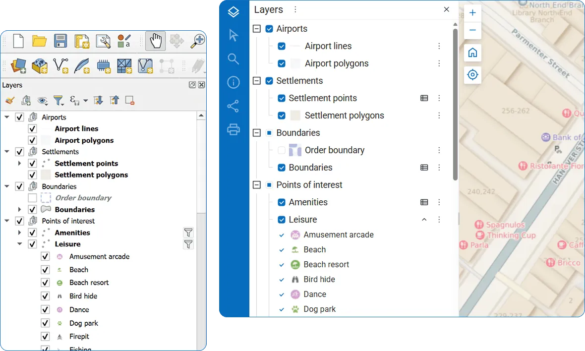
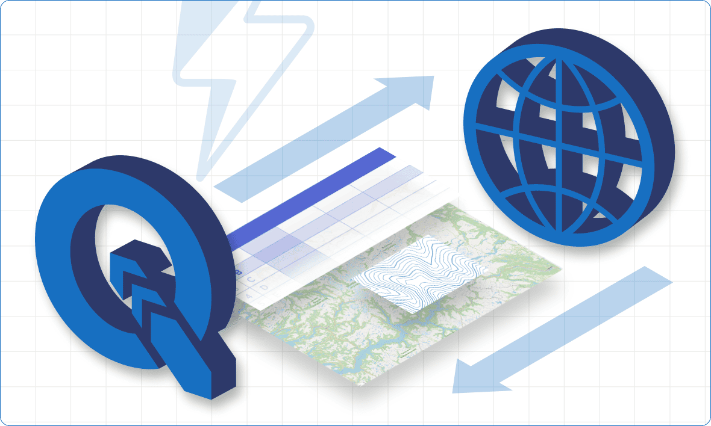
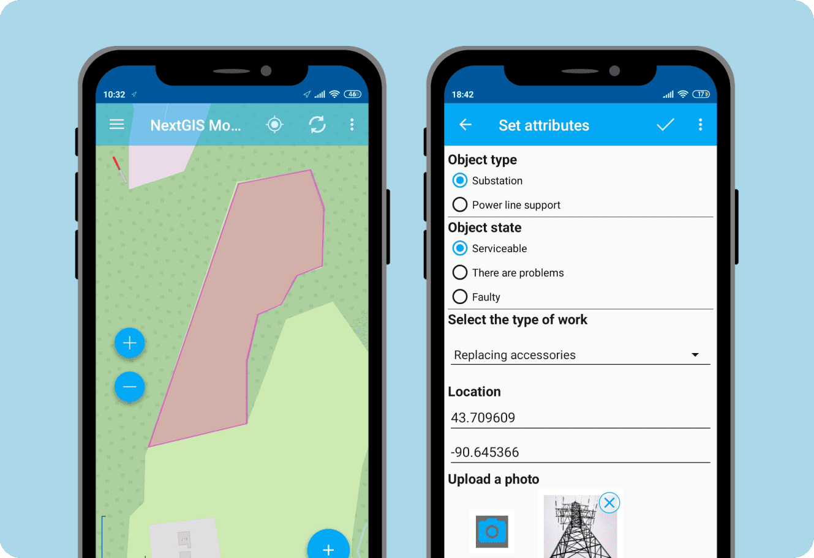
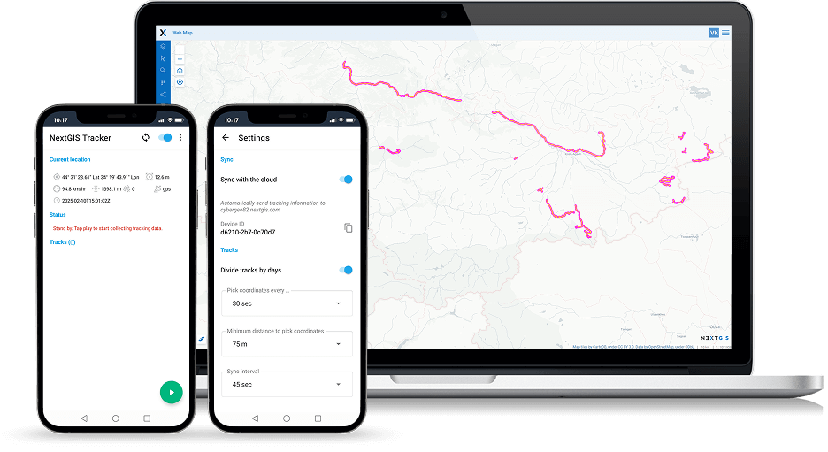

Tutoriales
=========

Descarga un kit de datos iniciales y sigue las instrucciones detalladas paso a paso para familiarizarte con la plataforma de NextGIS mediante la experiencia práctica.

1. `Almacenamiento, gestión y publicación de tus datos espaciales <https://docs.nextgis.com/docs_howto/source/tutorial_webgis.html>`_

2. `Integración fluida con QGIS <https://docs.nextgis.com/docs_howto/source/tutorial_qgis.html>`_

3. `Recolección de datos espaciales en el terreno <https://docs.nextgis.com/docs_howto/source/tutorial_collect.html>`_

4. `Seguimiento de ubicaciones GPS en tiempo real <https://docs.nextgis.com/docs_howto/source/tutorial_track.html>`_

