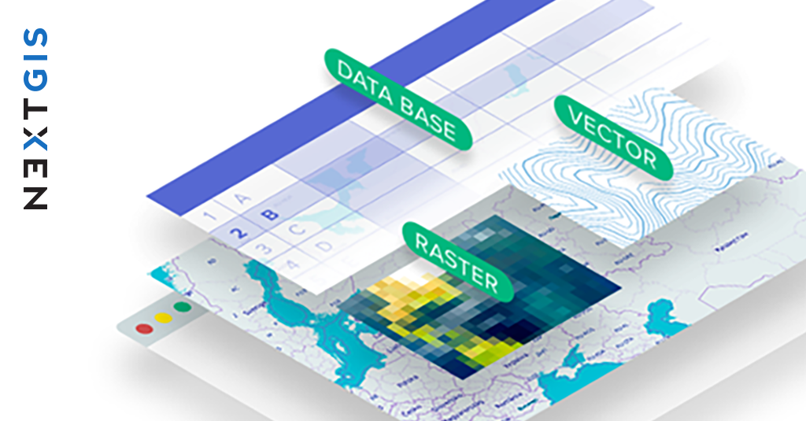
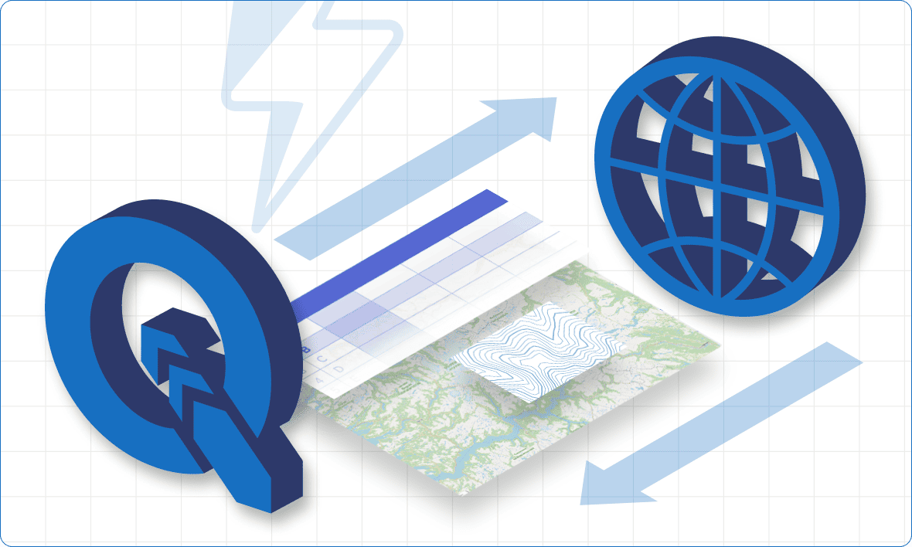
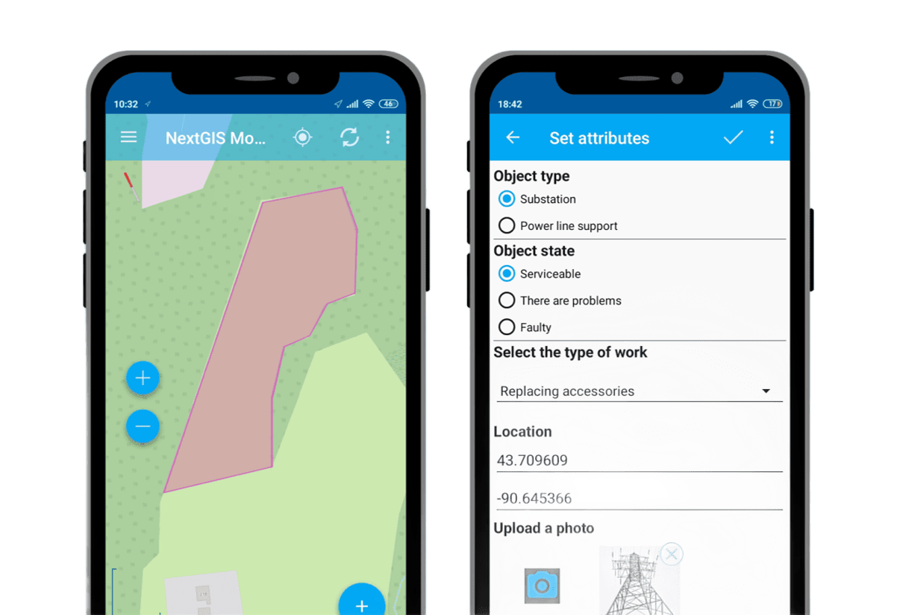
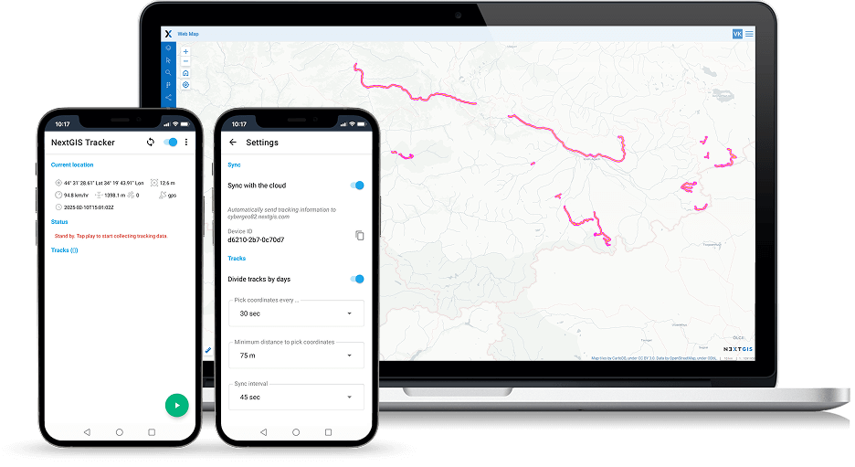

Tutoriales
=========

Descarga un kit de datos iniciales y sigue las instrucciones detalladas paso a paso para familiarizarte con la plataforma de NextGIS mediante la experiencia práctica.

1. :ref:`Almacenamiento, gestión y publicación de tus datos espaciales <tutorial-1>`

2. :ref:`Integración fluida con QGIS <tutorial-2>`

3. :ref:`Recolección de datos espaciales en el terreno <tutorial-3>`

4. :ref:`Seguimiento de ubicaciones GPS en tiempo real <tutorial-4>`

