Tutorial: Recolectar datos espaciales en el campo
=================================================

.. admonition:: Disponibilidad

    Cloud SaaS (todas las ediciones), On premise (Extended, Enterprise)

NextGIS Web es un servidor GIS orientado a datos que te permite almacenar, gestionar y publicar datos espaciales de forma flexible y eficaz. Tiene un subsistema integrado de recolección de datos móviles que puedes usar para organizar trabajo de campo colaborativo. En este tutorial paso a paso aprenderás cómo crear un proyecto de recolección de datos y comenzar a reunir información espacial con una aplicación móvil. ¡Registra una cuenta gratuita en la nube y pruébalo ahora mismo!

En este ejemplo, crearemos un proyecto para recolectar datos sobre árboles en la ciudad. Se requiere un teléfono Android para trabajar con la aplicación móvil.

Configuración

* `Paso 1. Cuenta gratuita y Web GIS <https://docs.nextgis.com/docs_howto/source/tutorial_collect.html#account>`_
* `Paso 2. Grupo de recursos <https://docs.nextgis.com/docs_howto/source/tutorial_collect.html#webgis>`_
* `Paso 3. Capa vectorial (base de datos) <https://docs.nextgis.com/docs_howto/source/tutorial_collect.html#create-layer>`_
* `Paso 4. Formulario de recolección de datos <https://docs.nextgis.com/docs_howto/source/tutorial_collect.html#form>`_ 
* `Paso 5. Lista de trabajadores de campo <https://docs.nextgis.com/docs_howto/source/tutorial_collect.html#collectors>`_
* `Paso 6. Collector project <https://docs.nextgis.com/docs_howto/source/tutorial_collect.html#project>`_

Recolecta y revisa los datos

* `Introducir datos <https://docs.nextgis.com/docs_howto/source/tutorial_collect.html#fieldwork>`_
* `Revisar y visualizar en Web GIS <https://docs.nextgis.com/docs_howto/source/tutorial_collect.html#check>`_

.. _account:

Paso 1/6 Crea una cuenta gratuita y Web GIS
-------------------------------------------

Ve a `my.nextgis.com`, haz clic en el botón **Create Account** y regístrate con tu dirección de correo electrónico. 

Después del registro aparecerá la página de tu cuenta. Selecciona el menú **Web GIS** a la izquierda, elige un nombre (ngw-quickstart.nextgis.com en este ejemplo) y selecciona la ubicación del centro de datos más cercana (DE Falkenstein en este ejemplo). Luego haz clic en **Create Web GIS**.

.. figure:: _static/tutorial_create_wg_en.png
   :name: 
   :align: center
   :width: 20cm

Cuando el proceso de creación termine, el contenido de la página cambiará. Aparecerá un enlace directo a tu nuevo Web GIS.

.. figure:: _static/tutorial_my_wg_en.png
   :name: 
   :align: center
   :width: 20cm

.. _webgis:

Paso 2/6 Accede a tu Web GIS y crea un grupo de recursos
--------------------------------------------------------

Haz clic en el enlace del Web GIS o escríbelo en tu navegador.

Verás la interfaz principal de tu Web GIS.

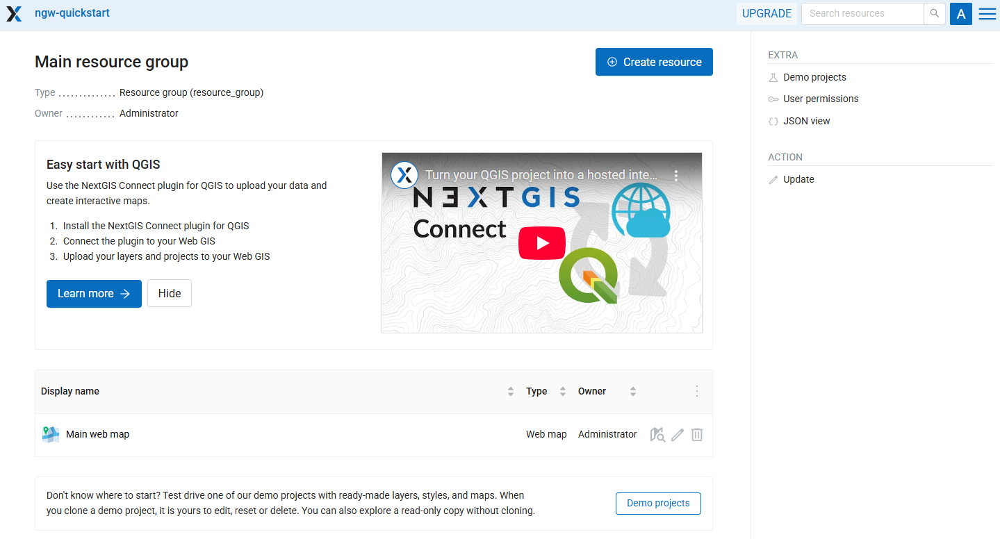

En NextGIS Web todo es un recurso: capas, Mapas Web, carpetas (grupos), conexiones a servicios y bases de datos. Los recursos se organizan como archivos en tu computadora: en un árbol. 

Vamos a crear nuestro primer recurso, una carpeta o *resource group* llamada Data collecting. Para hacerlo, haz clic en el botón azul **Create resource** en la parte superior de la página. 

.. tip:: Si no ves el botón **Create resource**, primero debes iniciar sesión. Haz clic en el botón **Sign in** en la esquina superior derecha y luego selecciona **Sign in with NextGIS ID**.

.. figure:: _static/tutorial_log_in_en.png
   :name: tutorial_log_in_pic
   :align: center
   :width: 20cm

Cuando hagas clic en **Create resource**, aparecerá una ventana que muestra todas las opciones disponibles de lo que puedes crear en el contexto actual. Selecciona **Resource group**.

.. figure:: _static/tutorial_select_group_en.png
   :name: tutorial_select_group_pic
   :align: center
   :width: 20cm

La ventana de creación de recursos consta de varias pestañas; en este caso solo necesitamos establecer el nombre ``Data collecting`` en la pestaña “Resource”.

.. figure:: _static/collect_create_group_en.png
   :name: collect_create_group_pic
   :align: center
   :width: 20cm

Haz clic en **Create** y serás redirigido a la página del nuevo recurso.

La URL de tu navegador es la ruta al recurso, y los números al final de la URL son el ID del recurso. 

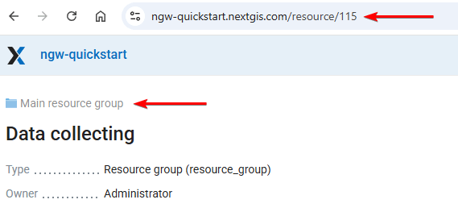

*Data collecting* es un hijo de la carpeta *Main resource group* donde lo creamos. El recurso padre se muestra encima del nombre del recurso.

Ahora puedes subir datos a esta carpeta.

.. _create_layer:

Paso 3/6 Crea una capa vectorial (contenedor para la recolección de datos)
--------------------------------------------------------------------------

A continuación necesitamos crear una capa vectorial; servirá como base de datos donde se almacenará la información recolectada sobre objetos geográficos. Haz clic en el botón **Create resource** y luego selecciona **Vector layer**.

.. figure:: _static/collect_select_layer_en.png
   :name: collect_select_layer_pic
   :align: center
   :width: 20cm

Es posible subir una capa vectorial desde un archivo o crearla desde cero. Abre el menú desplegable en la parte superior de la pestaña “Vector layer” y selecciona **Create empty layer**.

.. figure:: _static/collect_create_empty_layer_en.png
   :name: collect_create_empty_layer_pic
   :align: center
   :width: 20cm

En la interfaz cambiada, selecciona el tipo de geometría **Point**.

.. figure:: _static/tutorial_empty_layer_geom_en.png
   :name: tutorial_empty_layer_geom_pic
   :align: center
   :width: 20cm

En la pestaña **Resource**, establece el nombre de la nueva capa, ``Trees``, y haz clic en **Create**.

La capa vectorial se crea y serás redirigido a su página. Puedes ver los metadatos principales y la estructura de la capa (actualmente vacía).

.. figure:: _static/collect_vector_result_en.png
   :name: collect_vector_result_pic
   :align: center
   :width: 20cm

.. _form:

Paso 4/6 Crea un formulario de recolección de datos 
----------------------------------------------------

Al crear un formulario lograremos dos cosas a la vez:

1. Determinar qué tipo de datos queremos recolectar en la capa vectorial,
2. Crear una interfaz comprensible para los recolectores de datos.

En la página del recurso de capa vectorial, haz clic en **Create resource** y selecciona **Form**.

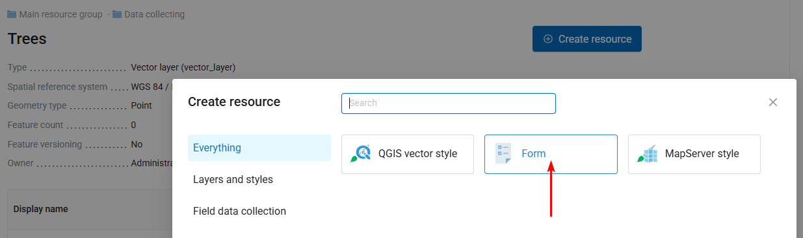

Cambia el modo a **Design form**

.. figure:: _static/collect_design_from_en.png
   :name: collect_design_from_pic
   :align: center
   :width: 20cm

En esta interfaz visual de arrastrar y soltar puedes construir un formulario que tus trabajadores de campo verán en sus dispositivos móviles. 

Esta pestaña se divide verticalmente en tres secciones:

* A la izquierda: una lista de elementos disponibles, 
* En el medio: el diseño para la pantalla del smartphone, 
* A la derecha: la configuración del elemento seleccionado.

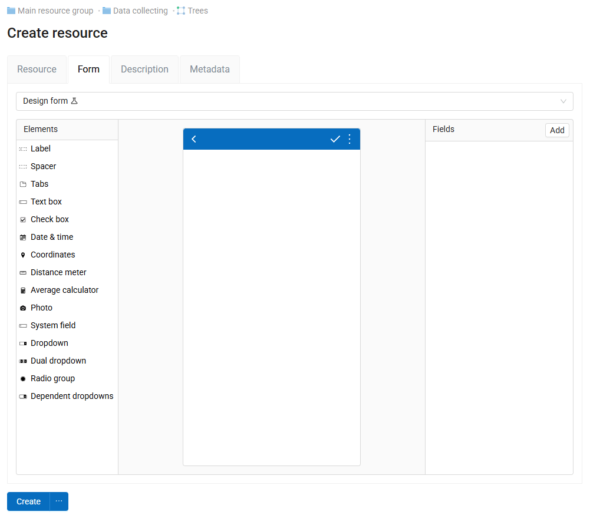

Haz clic en el elemento **Label** y arrástralo al diseño. Aparece con el valor de texto predeterminado. 

.. figure:: _static/collect_add_label_en.png
   :name: collect_add_label_pic
   :align: center
   :width: 20cm

En el panel derecho, busca el bloque **Properties** y establece el valor de la etiqueta en ``Tree species``. Este es el título del primer campo de datos que vamos a agregar.

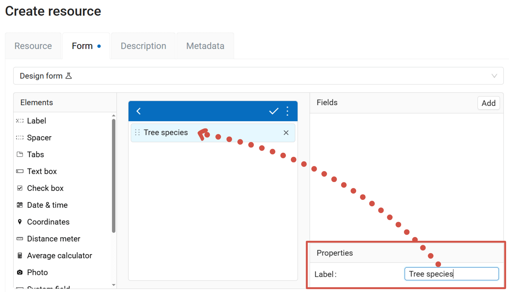

Ahora necesitamos agregar el campo donde los recolectores introducen los datos. Para este primer campo, proporcionaremos a los recolectores una lista predeterminada de especies de árboles. Selecciona el elemento **Dropdown** y arrástralo al diseño. 

Aparece un diálogo que te pide seleccionar el atributo de la capa en el que se escribirán los datos introducidos en este campo.

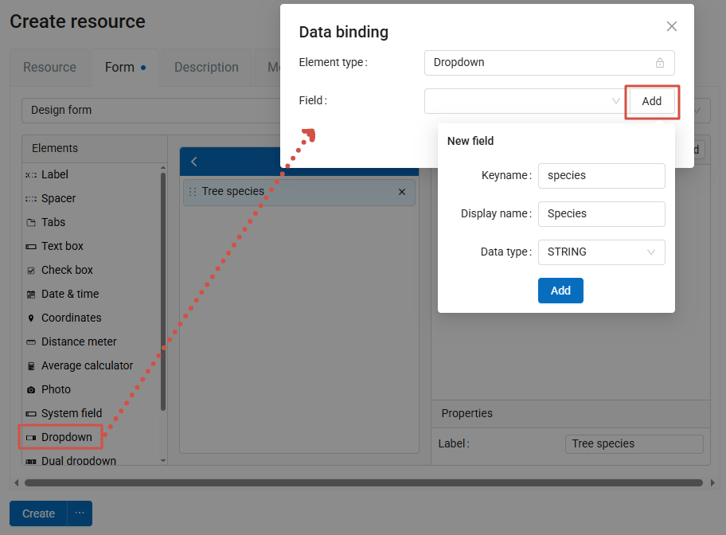

Actualmente todavía no tenemos atributos, así que haz clic en el botón **Add**. Para el nuevo campo, configura los parámetros:

* Keyname = ``species``,
* Display name = ``Species``,
* Data type = STRING.

Luego haz clic en el botón azul **Add**.

.. figure:: _static/collect_add_dropdown_en.png
   :name: collect_add_dropdown_pic
   :align: center
   :width: 12cm

Y luego **OK** en el diálogo Data binding.

Ahora el diseño se ve así:

.. figure:: _static/collect_dropdown_properties_en.png
   :name: collect_dropdown_properties_pic
   :align: center
   :width: 20cm

Haz clic en el elemento Dropdown y, en el bloque Properties, activa las casillas **Remember last value** y **Enable search**. 

Ahora necesitamos introducir la lista de opciones para elegir en el dropdown. Haz clic en el botón **Edit** junto a Options. 

Aparece una tabla vacía. La primera columna, **Value**, es lo que se registrará en la base de datos; **Label** es lo que los trabajadores de campo verán en la interfaz. 

Lo mantendremos simple y pondremos lo mismo en ambas columnas. Introduce seis opciones: ``Beech, Oak, Spruce, Pine, Birch, Other``.

.. figure:: _static/collect_dropdown_options_en.png
   :name: collect_dropdown_options_pic
   :align: center
   :width: 14cm

El siguiente elemento que vamos a agregar es una casilla de verificación simple. Haz clic en el elemento **Check box** y arrástralo al diseño. En el diálogo de vinculación, agrega un nuevo campo con:

* Keyname = ``damaged``, 
* Display name = ``damaged``, 
* Data type = INTEGER. 

En las propiedades del elemento establece:

* Label = ``The tree is damaged``. 

Este es el resultado que deberías obtener:

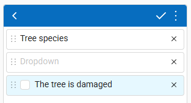

Para el siguiente elemento, haz clic en **Date & time** y arrástralo al diseño. En el diálogo de vinculación, agrega un nuevo campo con:

* Keyname = ``datetime``, 
* Display name = ``Date and time``, 
* Data type = DATETIME. 

En las propiedades del elemento, establece *Type* en Date & time.

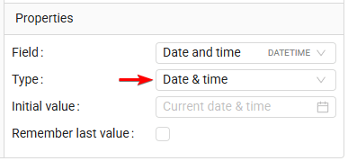

Luego haz clic en el elemento **Photo** y arrástralo al diseño. En las propiedades del elemento, establece el número *Max* en 5.

Ahora que agregamos todos los elementos, necesitamos agregar los campos correspondientes a la capa. Activa la casilla **Add absent fields to layer**. Este es el aspecto final del formulario:

.. figure:: _static/collect_add_absent_en.png
   :name: collect_add_absent_pic
   :align: center
   :width: 20cm

Haz clic en **Create**. Después de la creación, serás redirigido inmediatamente a la página del nuevo recurso. 

Para permitir que las personas usen este formulario para la recolección de datos, necesitas agregarlas a la lista de recolectores.

.. _collectors:

Paso 5/6 Crea la lista de trabajadores de campo
-----------------------------------------------

Abre el menú en la esquina superior derecha de la interfaz de NextGIS Web y ve al **Control panel**.

.. figure:: _static/collect_open_control_panel_en.png
   :name: collect_open_control_panel_pic
   :align: center
   :width: 10cm

Luego selecciona **Collector projects**.

.. figure:: _static/collect_control_panel_collector_en.png
   :name: collect_control_panel_collector_pic
   :align: center
   :width: 10cm

Aquí puedes gestionar la lista de usuarios conectados a tu Web GIS como recolectores de datos de campo. Cualquier usuario con una cuenta de NextGIS ID puede agregarse como recolector de datos de campo, incluso si no forma parte de tu `team <https://docs.nextgis.com/docs_ngcom/source/teams.html>`_.

Inicialmente la lista está vacía.

.. figure:: _static/collect_list_empty_en.png
   :name: collect_list_empty_pic
   :align: center
   :width: 20cm

Haz clic en **Create** para agregar un usuario a la lista de recolectores. Primero, agrégate a ti mismo. En el campo NextGIS ID, introduce el correo electrónico que usaste para registrarte en my.nextgis.com.

.. figure:: _static/collect_add_collector_en.png
   :name: collect_add_collector_pic
   :align: center
   :width: 20cm

Se agrega una nueva entrada a la lista de recolectores.

.. _project:

Paso 6/6 Crea un Collector project
-----------------------------------

Regresa al grupo de recursos “Data collecting” y crea un nuevo recurso: **Collector project**.

.. figure:: _static/collector_select_project_en.png
   :name: collector_select_project_pic
   :align: center
   :width: 20cm

En la pestaña Resource, establece el nombre del proyecto que los recolectores verán en la app. Introduce ``Trees in the city``.

.. figure:: _static/collect_project_name_en.png
   :name: collect_project_name_pic
   :align: center
   :width: 20cm

En la pestaña Project, deja todas las configuraciones con sus valores predeterminados.

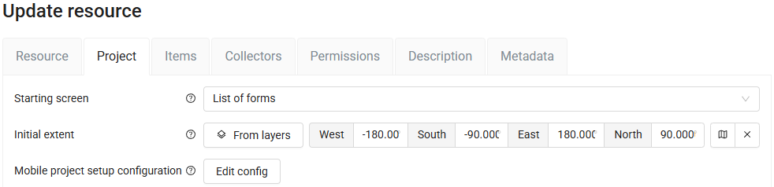

En la pestaña Items, determina el contenido de tu proyecto. ¿Qué datos deben reunir los trabajadores de campo? ¿Qué capa deben ver como referencia en el mapa? Haz clic en el botón **+ Layer** y selecciona la capa ``Trees``.

.. figure:: _static/collect_project_items_en.png
   :name: collect_project_items_pic
   :align: center
   :width: 20cm

Haz clic en el elemento agregado para ver sus propiedades en el panel de la derecha. 
Asegúrate de que las casillas *Editable* y *Syncable* estén activas.

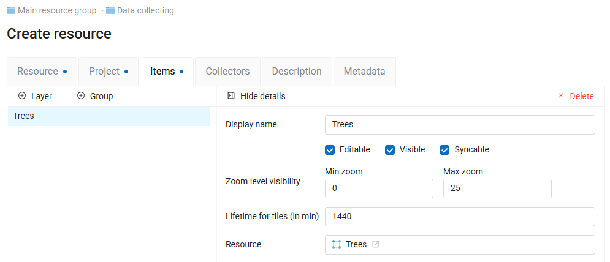

En la pestaña Collectors, activa la casilla junto a tu correo electrónico; esto te agrega como recolector de datos de campo a este proyecto.

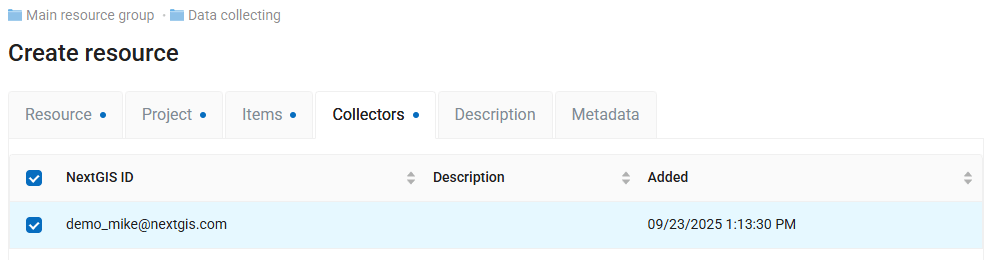

Haz clic en **Create** para finalizar.

Eso es todo. Se ha creado un proyecto y los trabajadores de campo podrían comenzar su trabajo.

Para este proyecto, actuarás como el recolector de datos tú mismo.

.. _fieldwork:

Recolecta datos en el campo (desde la perspectiva del trabajador de campo)
--------------------------------------------------------------------------

Instala la aplicación NextGIS Collector en tu dispositivo Android. Puedes encontrarla en Google Play.

Ejecuta la aplicación. Inicia sesión con el correo electrónico que usaste para crear tu NextGIS ID y su contraseña.

.. figure:: _static/collect_sign_in_en.png
   :name: collect_sign_in_pic
   :align: center
   :width: 8cm

Después de la autorización, puedes ver una lista de proyectos asignados a ti. Selecciona **Trees in the city** y confirma que te unes a él.

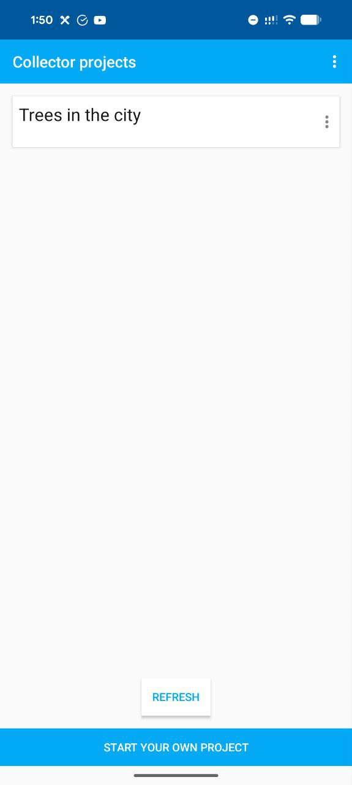

.. figure:: _static/collect_project_join_en.png
   :name: collect_project_join_pic
   :align: center
   :width: 8cm

Dentro del proyecto, ves una lista de capas. Este proyecto contiene solo una: *Trees*. 

Acércate al árbol más cercano y haz clic en **USING GPS**; esto registra las coordenadas GPS actuales de tu teléfono móvil y abre el formulario para introducir la demás información. 

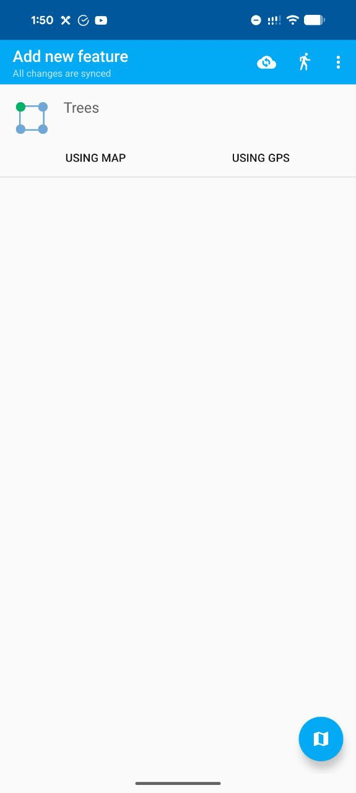

Elige la especie del árbol en el dropdown, marca si está dañado, agrega una o varias fotos y luego haz clic en el botón |button_tick| para guardar.

.. figure:: _static/collect_tree_new_feature_en.png
   :name: collect_tree_new_feature_pic
   :align: center
   :width: 8cm

.. figure:: _static/collect_add_photo_en.png
   :name: collect_add_photo_pic
   :align: center
   :width: 8cm

Los datos están recolectados. Como trabajador de campo, puedes ir al siguiente árbol y repetir el procedimiento.

.. _check:

Revisa los datos recolectados en Web GIS
----------------------------------------

Regresa a Web GIS y abre el recurso de capa vectorial *Trees*. En sus metadatos puedes ver que el recuento de entidades ha cambiado. Se sincroniza a medida que los datos recolectados se suben a la nube.

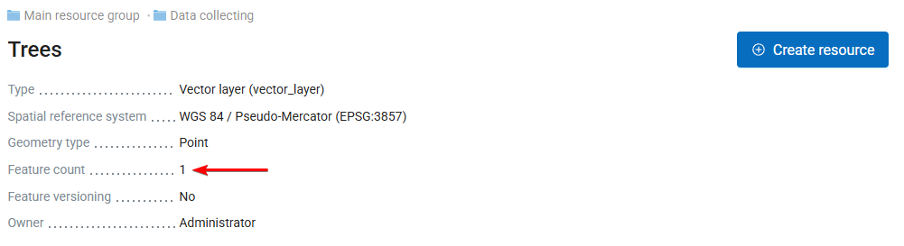

Para mostrar la entidad agregada, haz clic en el botón de vista previa:

.. figure:: _static/collect_preview_layer_en.png
   :name: collect_preview_layer_pic
   :align: center
   :width: 20cm

O revisa los valores de los atributos en la tabla de entidades:

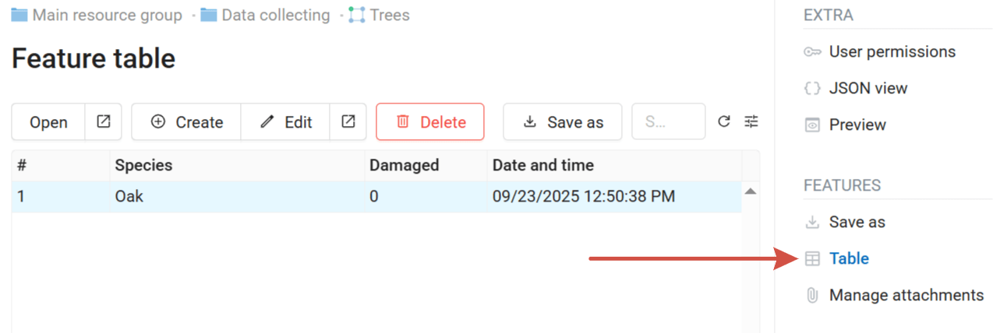

Abre la vista previa de la entidad para ver la foto adjunta.

.. figure:: _static/collect_feature_preview_en.png
   :name: collect_feature_preview_pic
   :align: center
   :width: 20cm

Esto te permite hacer seguimiento del proceso de recolección de datos en tiempo real. La capa que almacena los datos se puede usar como cualquier otra: agregarse a Mapas Web, publicarse como teselas o mediante protocolos OGC, descargarse, conectarse a QGIS, etc.
