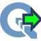
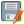
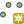
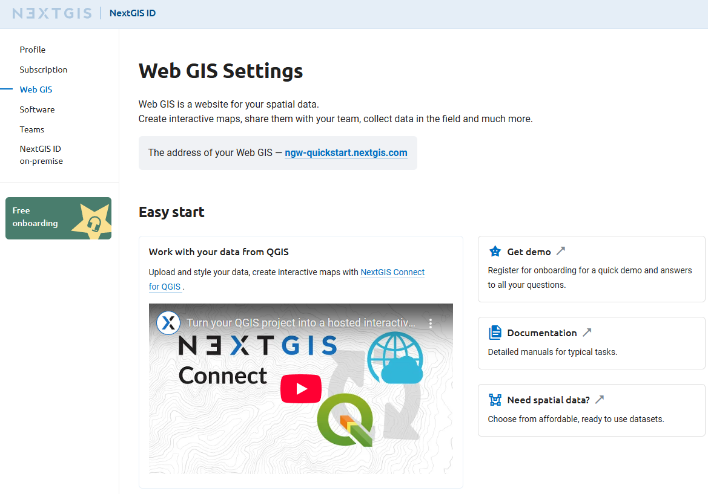
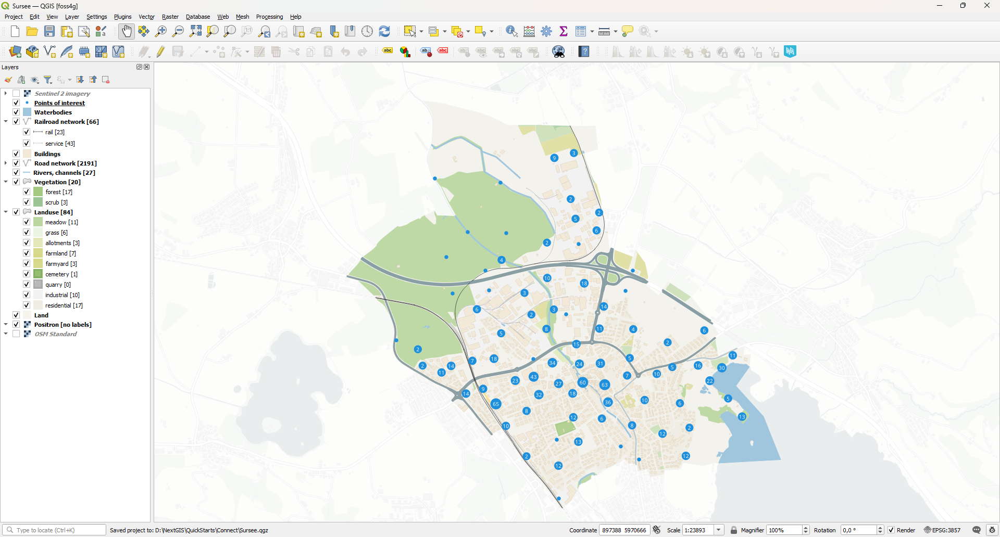
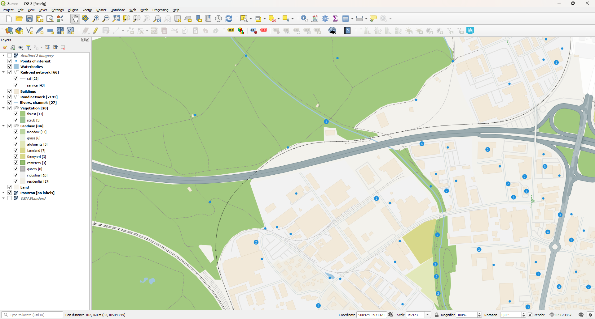
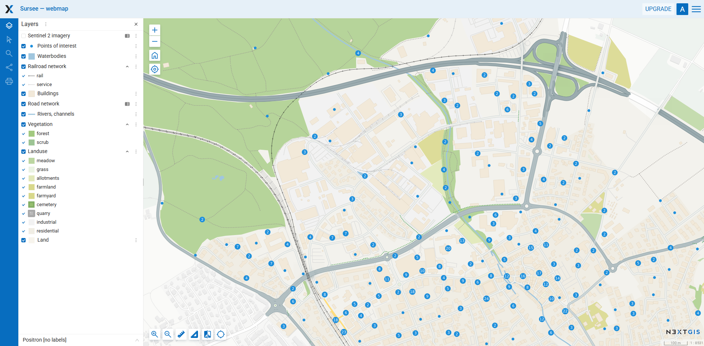
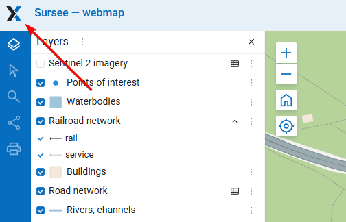

Tutorial: Integración Fluída con QGIS  
====================================

.. |ngconnect_icon| image:: _static/ngconnect_logo-45.png
   :width: 6mm
   :alt: blue shield with white arrows

.. |button_settings| image:: _static/button_settings.png
   :width: 6mm
   :alt: gear

.. |symbologyAdd| image:: _static/symbologyAdd.png
   :width: 6mm
   :alt: green plus

.. |button_to_qgis| image:: _static/button_to_qgis.png
   :width: 6mm

.. |NextGISLogo| image:: _static/NextGISLogo.png
   :width: 6mm
   :alt: blue and black X

.. |synchronized| image:: _static/synchronized.png
   :width: 6mm

.. |mActionToggleEditing| image:: _static/mActionToggleEditing.png
   :width: 6mm

   

.. admonition:: Disponibilidad

   Cloud SaaS (todas las ediciones), On premise (todas las ediciones), Open Source

NextGIS Web es un servidor GIS que funciona como centro de datos, te permitirá almacenar, administrar y publicar información espacial de manera flexible y eficiente. Tiene una integración profunda con QGIS, el principal software GIS libre y de código abierto.

Esta integración abarca la publicación de proyectos como mapas web, la conexión a estos desde el escritorio, la sincronización de datos y la edición colaborativa desde múltiples instancias de QGIS.

En este tutorial paso a paso aprenderás a publicar tu proyecto en la web, conectarte a él desde otro equipo, administrar los estilos de los mapas web y editar datos directamente en el servidor, todo sin salir de tu entorno de trabajo habitual. ¡Regístrate para obtener una cuenta gratuita en la nube y empezá ahora mismo!

:download:`Descarga los datos del tutorial <https://nextgis.com/tutorials/seamless_qgis_integration.zip>` (fuente: `OpenStreetMap <https://www.openstreetmap.org/>`_, `data.nextgis.com <http://data.nextgis.com>`_, `Copernicus <https://browser.dataspace.copernicus.eu/>`_)

.. seealso:: `Almacena, gestiona y publica tus datos espaciales <https://docs.nextgis.com/docs_howto/source/tutorial_webgis.html>`_

Publica tu proyecto de QGIS en línea

1. `Crea una cuenta gratuita y un Web GIS <https://docs.nextgis.com/docs_howto/source/tutorial_qgis.html#account>`_
2. `Abre y explora el proyecto de QGIS <https://docs.nextgis.com/docs_howto/source/tutorial_qgis.html#project>`_
3. `Instala el plugin NextGIS Connect <https://docs.nextgis.com/docs_howto/source/tutorial_qgis.html#install>`_
4. `Crea una conexión <https://docs.nextgis.com/docs_howto/source/tutorial_qgis.html#connection>`_
5. `Publica el proyecto de QGIS en NextGIS Web <https://docs.nextgis.com/docs_howto/source/tutorial_qgis.html#publish>`_

Resultado: `Explora el mapa web y los recursos <https://docs.nextgis.com/docs_howto/source/tutorial_qgis.html#webmap>`_

Usa QGIS para editar datos almacenados en Web GIS

6. `Conéctate al mapa web desde QGIS <https://docs.nextgis.com/docs_howto/source/tutorial_qgis.html#download>`_
7. `Actualiza los estilos de las capas del mapa web desde QGIS <https://docs.nextgis.com/docs_howto/source/tutorial_qgis.html#vector_style>`_
8. `Actualiza el estilo de una capa ráster en un mapa web <https://docs.nextgis.com/docs_howto/source/tutorial_qgis.html#raster_style>`_
9. `Edita datos desde QGIS y explora los resultados en el mapa web <https://docs.nextgis.com/docs_howto/source/tutorial_qgis.html#edit_data>`_

Puedes ver las instrucciones detalladas a continuación o mirar el vídeo:

.. raw:: html

   <iframe width="560" height="315" src="https://www.youtube.com/embed/mDbkUWVhs_M?si=x_zsHyECKGUGjfYa" title="Reproductor de vídeo de YouTube" frameborder="0" allow="accelerometer; autoplay; clipboard-write; encrypted-media; gyroscope; picture-in-picture; web-share" referrerpolicy="strict-origin-when-cross-origin" allowfullscreen></iframe>

Míralo en `youtube <https://youtu.be/mDbkUWVhs_M?si=4UOhAYuEg-AUKwkn>`_.

.. _account:

Paso 1/5: Crea una cuenta gratuita y un Web GIS
-----------------------------------------

Ve a `my.nextgis.com`, haz clic en el botón **Crear cuenta** y regístrate con tu dirección de correo electrónico.

Después del registro, aparecerá tu página de cuenta. Selecciona el menú **Web GIS** en la izquierda, elige un nombre (en este ejemplo, ngw-quickstart.nextgis.com) y selecciona la ubicación del centro de datos más cercana (en este ejemplo, DE Falkenstein). Luego haz clic en **Crear Web GIS**.

.. figure:: _static/tutorial_create_wg_en.png
   :name: tutorial_create_wg_pic
   :align: center
   :width: 20cm

Cuando el proceso de creación termine, el contenido de la página cambiará. Aparecerá el enlace directo a tu nuevo Web GIS.

Copia la dirección del Web GIS creado. En este ejemplo: ``https://ngw-quickstart.nextgis.com``. La necesitarás más adelante para crear una conexión.

.. _project:

Paso 2/5: Abre y explora el proyecto de QGIS
---------------------------------------

`Descarga los datos del tutorial <https://nextgis.com/tutorials/seamless_qgis_integration.zip>`_ y descomprime el archivo.

Haz clic en el archivo llamado ``Sursee.qgz`` para abrirlo en QGIS.

.. note:: Si aún no tienes QGIS, `descárgalo <https://qgis.org/download/>`_ e instálalo.

Este es un proyecto típico de QGIS con capas ráster y vectoriales, varios mapas base y estilos avanzados dependientes de la escala configurados con expresiones. Los puntos de interés están estilizados con el renderizador avanzado “Agrupación de puntos” que usa un tamaño de símbolo de clúster dinámico. También hay iconos SVG incrustados en la capa “Red de carreteras”.

Acércate para explorar el estilo multiescala.

.. _install:

Paso 3/5: Instala el plugin NextGIS Connect
----------------------------------------

Ve al menú “Complementos” → “Administrar e instalar complementos”.

.. figure:: _static/tut_menu_manage_plugins_en.png
   :name: tut_menu_manage_plugins_pic
   :align: center
   :width: 12cm

Ve a la pestaña “Todos” y busca un complemento llamado NextGIS Connect. Usa la barra de búsqueda en la parte superior de la interfaz para acceder más rápido. Haz clic en el botón **Instalar complemento**.

.. figure:: _static/tut_install_ngconnect_en.png
   :name: tut_install_ngconnect_pic
   :align: center
   :width: 16cm

Después de la instalación, NextGIS Connect está disponible en el menú “Internet” y como un icono en la barra de herramientas: |ngconnect_icon|. Cuando NextGIS Connect está activo, el panel lateral es visible.

.. figure:: _static/tut_ngconnect_in_qgis_en.png
   :name: tut_ngconnect_in_qgis_pic
   :align: center
   :width: 20cm

Ve a la configuración del complemento usando el icono |button_settings|. Este es el lugar para configurar todo lo relacionado con la integración QGIS–NextGIS Web. Primero, creemos una conexión.

.. _connection:

Paso 4/5: Crea una conexión
-----------------------------

Para establecer un vínculo entre tu aplicación QGIS y un Web GIS, necesitas crear una conexión.

Ve a la `página de Web GIS <https://my.nextgis.com/webgis/>`_ de tu cuenta de NextGIS ID y copia el enlace a tu Web GIS (consulta :numref:`tutorial_my_wg_pic`). En este ejemplo, el enlace es: ``https://ngw-quickstart.nextgis.com``.

En QGIS, abre la configuración de NG Connect y haz clic en el botón **Nuevo** en el grupo “Conexiones”.

.. figure:: _static/tut_ngcn_new_connection_en.png
   :name: tut_ngcn_new_connection_pic
   :align: center
   :width: 20cm

Ingresa la dirección del Web GIS en el campo URL, luego haz clic en |symbologyAdd| para crear una nueva configuración de autenticación.

.. figure:: _static/tut_ngcn_create_connection_en.png
   :name: tut_ngcn_create_connection_pic
   :align: center
   :width: 12cm

En el nuevo cuadro de diálogo, ingresa el correo electrónico y la contraseña que usaste para registrarte en my.nextgis.com en el paso 1, y haz clic en el botón **Guardar**.

.. figure:: _static/tut_ngcn_authentication_en.png
   :name: tut_ngcn_authentication_pic
   :align: center
   :width: 10cm

Haz clic en el botón **Probar conexión** para asegurarte de que ingresaste todos los datos correctamente. Luego haz clic en el botón **Guardar**.

.. figure:: _static/tut_ngcn_test_connection_en.png
   :name: tut_ngcn_test_connection_pic
   :align: center
   :width: 12cm

.. tip:: Si vas a **editar datos de forma colaborativa**, puedes activar la casilla de verificación “Habilitar versionado de entidades para capas vectoriales al cargar”.

.. figure:: _static/tut_enable_versioning_en.png
   :name: tut_enable_versioning_pic
   :align: center
   :width: 16cm

Sal de la configuración haciendo clic en el botón **Aceptar** en la parte inferior de la página.

Ahora, en el panel de NextGIS Connect puedes ver el árbol de recursos de tu Web GIS.

.. figure:: _static/tut_ngcn_panel_connected_en.png
   :name: tut_ngcn_panel_connected_pic
   :align: center
   :width: 10cm

Usando este panel, puedes cargar datos locales a Web GIS, conectar capas y mapas remotos a QGIS, actualizar estilos, crear servicios y mucho más. También proporciona una forma sencilla de cargar un proyecto QGIS completo como un mapa web.

.. _publish:

Paso 5/5: Publica el proyecto de QGIS en NextGIS Web
--------------------------------------------

En el panel de NextGIS Connect, selecciona la carpeta *Grupo de recursos principal*, luego abre el menú desplegable con el icono |button_to_wg| y selecciona **Cargar todo**.

.. figure:: _static/tut_upload_all_en.png
   :name: tut_upload_all_pic
   :align: center
   :width: 10cm

Ingresa un nombre para el proyecto. En este ejemplo, es ``Sursee``. Se crea una carpeta con este nombre en Web GIS y se cargan todos los datos del proyecto allí.

.. figure:: _static/tut_upload_name_en.png
   :name: tut_upload_name_pic
   :align: center
   :width: 8cm

Comienza la carga. Puedes seguir el progreso revisando el mensaje de estado.

.. figure:: _static/tut_upload_status_en.png
   :name: tut_upload_status_pic
   :align: center
   :width: 10cm

Por defecto, una vez que el mapa web se publica con éxito, se abre automáticamente en tu navegador. También puedes abrirlo desde el panel de Connect. Haz clic derecho en el mapa web y selecciona "Abrir en el navegador" en el menú contextual.

Ten en cuenta que todas las capas del proyecto ahora son visibles en el panel de NextGIS Connect.

.. figure:: _static/tut_open_in_browser_en.png
   :name: tut_open_in_browser_pic
   :align: center
   :width: 10cm

Ahora puedes explorar el mapa web. Continúa con el paso 6 para aprender cómo conectarte a un mapa web existente en QGIS.

.. _webmap:

Explora el mapa web y los recursos
~~~~~~~~~~~~~~~~~~~~~~~~~~~~~~~~~~~~

Se ha creado un mapa web a partir del proyecto. Se ve exactamente igual que el proyecto QGIS original, porque NextGIS Web usa los estilos de QGIS como la forma principal de definir los estilos de las capas.

Puedes activar y desactivar capas y categorías dentro de las capas. El mapa web tiene su propia URL, por lo que puedes compartirlo fácilmente. Juega con la interfaz del mapa web. Obtén más información al respecto: https://docs.nextgis.com/docs_ngweb/source/webmaps_client.html

Haz clic en el icono |NextGISLogo| en la esquina superior izquierda para ver la interfaz principal con la lista de recursos.

Abre la carpeta Sursee. Para cada capa del proyecto original se creó un recurso correspondiente en ella.

Puedes trabajar con las capas vectoriales y ráster cargadas de forma independiente del mapa web: modificar los datos, publicarlos usando diferentes protocolos, etc.

.. figure:: _static/tut_wg_sursee_en.png
   :name: tut_wg_sursee_pic
   :align: center
   :width: 20cm

¿Y si quieres editar las capas cargadas en QGIS? Veamos cómo hacerlo.

.. _download:

Conéctate al mapa web desde QGIS
-----------------------------------

En QGIS, cierra el proyecto (Proyecto → Cerrar). Imagina que trabajas desde otro ordenador, desde otra instancia de QGIS. Mantén abierto el panel de NextGIS Connect (vuélvelo a abrir si está cerrado).

En el panel de NextGIS Connect, busca el recurso de mapa web *Sursee - webmap*, haz clic derecho para abrir el menú contextual y selecciona |button_to_qgis| **Agregar a QGIS**.

.. figure:: _static/tut_add_to_qgis_en.png
   :name: tut_add_to_qgis_pic
   :align: center
   :width: 10cm

QGIS reconstruye el contenido del mapa web localmente, descargando todas las capas y estilos relevantes y organizándolos para que coincidan con la estructura original.

Lo que obtienes es básicamente el proyecto inicial reconstruido completamente a partir de NextGIS Web.

.. figure:: _static/tut_downloaded_en.png
   :name: tut_downloaded_pic
   :align: center
   :width: 20cm

Observa que en el panel de Capas, las capas vectoriales tienen marcas especiales a la derecha de sus nombres: |synchronized|.

.. figure:: _static/tut_synched_layers_en.png
   :name: tut_synched_layers_pic
   :align: center
   :width: 14cm

Ahora están vinculadas al almacenamiento del servidor. Si los datos se actualizan en el servidor, Connect sincroniza la capa local en QGIS. Si la capa sincronizada se actualiza en QGIS, Connect lo comunica al servidor y actualiza los datos en el servidor.

Uno de los grandes usos de esto es actualizar los estilos en el mapa web.

.. _vector_style:

Modifica los estilos de las capas en el mapa web desde QGIS
---------------------------------------------

Hagamos que las vías de tren sean más brillantes y visibles en nuestro mapa web.

En QGIS, busca la capa *Red de ferrocarriles* en el panel de Capas. Abre el menú contextual de la categoría de símbolos “rail” (ferrocarril). En la paleta, haz clic en el anillo de color para seleccionar el color rojo. Haz clic en la parte vacía del panel para cerrar el cuadro de diálogo.

.. figure:: _static/tut_pick_color_en.png
   :name: tut_pick_color_pic
   :align: center
   :width: 10cm

Luego, busca y selecciona la capa *Red de ferrocarriles* en el panel de NextGIS Connect.

.. figure:: _static/tut_railroad_select_en.png
   :name: tut_railroad_select_pic
   :align: center
   :width: 12cm

Vuelve al panel de Capas, abre el menú contextual de la capa “Red de ferrocarriles” y haz clic en **NextGIS Connect → Actualizar estilo de capa**.

.. figure:: _static/tut_update_v_style_en.png
   :name: tut_update_v_style_pic
   :align: center
   :width: 16cm

Vuelve al navegador web con el mapa web abierto (vuelve a abrirlo desde el panel de NextGIS Connect si está cerrado). Verás que los ferrocarriles han cambiado su color a rojo.

.. figure:: _static/tut_webmap_red_rail_en.png
   :name: tut_webmap_red_rail_pic
   :align: center
   :width: 20cm

También puedes modificar los estilos ráster.

.. _raster_style:

Actualiza el estilo de una capa ráster en un mapa web
-----------------------------------------

En QGIS, activa la capa *Imágenes Sentinel 2*. Es un conjunto de datos satelitales de 4 bandas, configurado actualmente para mostrarse en colores naturales.

.. figure:: _static/tut_raster_initial_en.png
   :name: tut_raster_initial_pic
   :align: center
   :width: 20cm

Abre su menú contextual y ve a “Propiedades”.

.. figure:: _static/tut_raster_context_en.png
   :name: tut_raster_context_pic
   :align: center
   :width: 14cm

En Propiedades, ve a la pestaña Simbología y cambia ``Banda 3`` por ``Banda 4`` en el selector de *Banda roja*. Luego haz clic en **Aceptar**.

.. figure:: _static/tut_raster_bands_en.png
   :name: tut_raster_bands_pic
   :align: center
   :width: 20cm

Acabamos de reemplazar los datos de reflectancia del rojo por los datos de reflectancia del infrarrojo cercano, por lo que la visualización del ráster ha cambiado significativamente.

.. figure:: _static/tut_raster_nir_en.png
   :name: tut_raster_nir_pic
   :align: center
   :width: 20cm

Abre el mapa web y activa la capa “Imágenes Sentinel 2”. Todavía tiene su apariencia original.

.. figure:: _static/tut_raster_webmap_en.png
   :name: tut_raster_webmap_pic
   :align: center
   :width: 20cm

Vuelve a QGIS, selecciona la capa *Imágenes Sentinel 2* en el panel de NextGIS Connect.

.. figure:: _static/tut_raster_select_en.png
   :name: tut_raster_select_pic
   :align: center
   :width: 12cm

Luego, abre el menú contextual de la capa y haz clic en **NextGIS Connect → Actualizar estilo de capa**.

.. figure:: _static/tut_update_r_style_en.png
   :name: tut_update_r_style_pic
   :align: center
   :width: 14cm

Abre el mapa web nuevamente: el estilo de la capa ha cambiado.

.. figure:: _static/tut_raster_webmap_nir_en.png
   :name: tut_raster_webmap_nir_pic
   :align: center
   :width: 20cm

NextGIS Web puede manejar rásteres multibanda con estilos de QGIS de cualquier complejidad.

.. _edit_data:

Edita datos desde QGIS y explora los resultados en el mapa web
-------------------------------------------------------

Vuelve a QGIS. En el panel de Capas, selecciona la capa *Puntos de interés*, abre su menú contextual y habilita |mActionToggleEditing| el modo de edición. Como esta capa se agregó desde NextGIS Connect, está vinculada a Web GIS, por lo que las ediciones se sincronizan con el servidor.

.. figure:: _static/tut_toggle_editing_en.png
   :name: tut_toggle_editing_pic
   :align: center
   :width: 12cm

Habilita la barra de herramientas de Digitalización y activa la herramienta |button_add_point| **Añadir punto**.

.. figure:: _static/tut_digitizing_en.png
   :name: tut_digitizing_pic
   :align: center
   :width: 16cm

Vamos a colocar otro lugar para hacer barbacoa en el bosque. Haz clic izquierdo en un lugar adecuado en el mapa, luego ingresa un valor de atributo, AMENITY = ``bbq``. Luego haz clic en **Aceptar**.

.. figure:: _static/tut_new_point_en.png
   :name: tut_new_point_pic
   :align: center
   :width: 16cm

Haz clic en |mActionToggleEditing| para salir del modo de edición y selecciona **Guardar** en el cuadro de diálogo para guardar los cambios.

.. figure:: _static/tut_qgis_stop_edit_en.png
   :name: tut_qgis_stop_edit_pic
   :align: center
   :width: 20cm

Después de salir del modo de edición, la sincronización comienza automáticamente. La nueva entidad se envía al servidor. Vuelve al mapa web para verla.

.. figure:: _static/tut_added_on_webmap_en.png
   :name: tut_added_on_webmap_pic
   :align: center
   :width: 20cm

Los usuarios pueden conectarse a los mismos datos del servidor desde múltiples instancias de QGIS y editar los datos simultáneamente. Nuestra pila tecnológica proporciona una solución lista para usar que permite la digitalización en equipo y la edición de datos en QGIS.