Tutorial: Rastreo de recursos y ubicaciones de equipos en tiempo real
=========================================================

.. admonition:: Disponibilidad

   Cloud SaaS (todas las ediciones), On premise (Extended, Enterprise)

NextGIS Web es un servidor GIS centrado en datos que te permite almacenar, gestionar y publicar datos espaciales de forma flexible y eficaz. Tiene un subsistema integrado de recolección de datos móviles que puedes usar para organizar trabajo de campo colaborativo y rastrear activos y equipos en tiempo real, así como simplemente registrar tus propios movimientos.

En este tutorial paso a paso aprenderás cómo comenzar a recolectar tracks GPS y monitorearlos en un mapa en tiempo real.

Se requiere un smartphone Android para trabajar con la aplicación móvil.

Básico:

* Paso 1. `Crear una cuenta gratuita y Web GIS <tutorial_track.rst#paso-14-crear-una-cuenta-gratuita-y-web-gis>`_
* Paso 2. `Instalar y configurar NextGIS Tracker en tu dispositivo Android <tutorial_track.rst#paso-24-instalar-y-configurar-nextgis-tracker-en-tu-dispositivo-android>`_
* Paso 3. `Empezar a recolectar ubicaciones <tutorial_track.rst#paso-34-empieza-a-recolectar-ubicaciones-mientras-haces-un-paseo-corto>`_
* Paso 4. `Ver la ubicación actual del tracker y el track grabado en un Web Map <tutorial_track.rst#paso-44-ver-la-ubicación-actual-del-tracker-y-el-track-grabado-en-un-web-map>`_

Avanzado:

* `Crear reports <tutorial_track.rst#crear-reports>`_
* `Exportar archivo GPX <tutorial_track.rst#exportar-archivo-gpx>`_
* `Gestionar trackers <tutorial_track.rst#gestionar-trackers>`_

.. _account:

Paso 1/4 Crear una cuenta gratuita y Web GIS
--------------------------------------------

Ve a `my.nextgis.com <https://my.nextgis.com/>`_, haz clic en el botón **Create Account** y regístrate con tu dirección de correo electrónico.

Después del registro, aparecerá la página de tu cuenta. Selecciona el menú **Web GIS** a la izquierda, elige un nombre (ngw-quickstart.nextgis.com en este ejemplo) y selecciona la ubicación del Data center más cercana (DE Falkenstein en este ejemplo). Luego haz clic en **Create Web GIS**.

.. figure:: _static/tutorial_create_wg_en.png
   :name: tutorial_create_wg_pic
   :align: center
   :width: 20cm

Cuando finalice el proceso de creación, el contenido de la página cambiará. Aparecerá un enlace directo a tu nuevo Web GIS.

.. figure:: _static/tutorial_my_wg_en.png
   :name: tutorial_my_wg_pic
   :align: center
   :width: 20cm

.. _install:

Paso 2/4 Instalar y configurar NextGIS Tracker en tu dispositivo Android
------------------------------------------------------------------------

Instala la aplicación NextGIS Tracker en tu dispositivo Android. La puedes encontrar en Google Play.

Ejecuta la aplicación. Permite el acceso a la ubicación de tu dispositivo.

Puedes empezar a grabar tracks locales de inmediato y luego compartirlos como archivos GPX. Pero queremos sincronizar los tracks con Web GIS.

Toca el interruptor de sincronización en la esquina superior derecha de la interfaz:

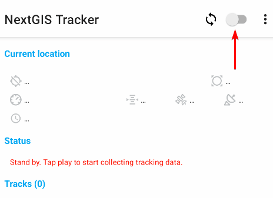

En la siguiente pantalla, ingresa el nombre de tu Web GIS (creado en el paso 1; en este ejemplo, ngw-quickstart.nextgis.com), luego el correo electrónico y la contraseña que usaste para crear tu NextGIS ID.

.. figure:: _static/webgis_creds_en.png
   :name: webgis_creds_pic
   :align: center
   :width: 8cm

Toca el ícono verde en la esquina inferior para guardar los cambios.

La sincronización activa se indica con el color azul del interruptor, así como con el símbolo |icon_layer_sync| junto a él. Ahora la App envía todos los tracks GPS recolectados al Web GIS.

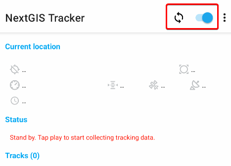

.. _record:

Paso 3/4 Empieza a recolectar ubicaciones mientras haces un paseo corto
-----------------------------------------------------------------------

Para empezar a grabar tu primer track, toca el botón verde “Start” en la esquina inferior derecha.

La aplicación te pedirá que permitas que la app acceda a la ubicación de forma continua incluso cuando no esté en uso. Esto es importante para que la App pueda grabar tracks.

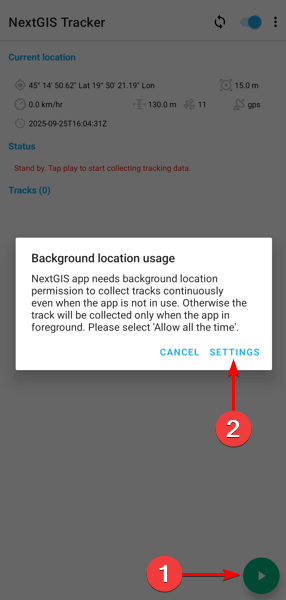

Ve a los Settings de tu dispositivo y selecciona “Allow all the time” para la app Tracker. El cuadro de diálogo puede variar según la versión de Android.

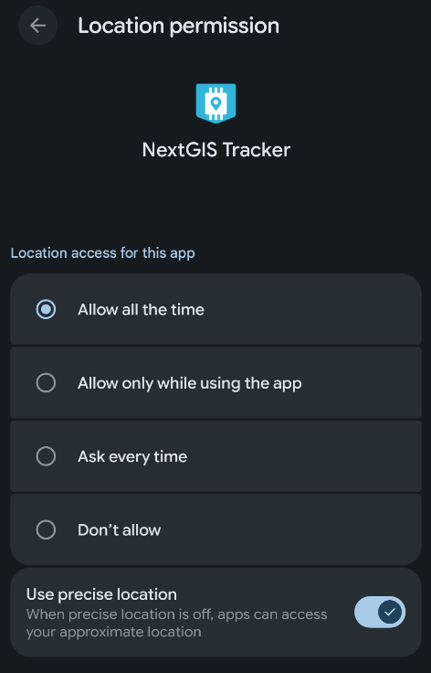

Ahora, cuando regreses a la app, verás un nuevo estado: “Collecting tracking data and syncing…”.

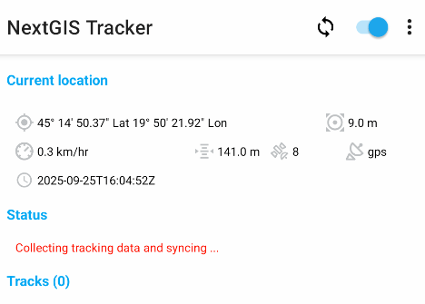

¡Da un paseo corto para recolectar algunas ubicaciones!

Puedes monitorear tus movimientos en tiempo real usando Web Map.

.. _position:

Paso 4/4 Ver la ubicación actual del tracker y el track grabado en un Web Map
-----------------------------------------------------------------------------

Abre tu Web GIS en un navegador haciendo clic en el enlace resaltado en `tu cuenta <https://my.nextgis.com/webgis/>`_ o escribiéndolo directamente en la barra de direcciones. Verás la interfaz principal de tu Web GIS.

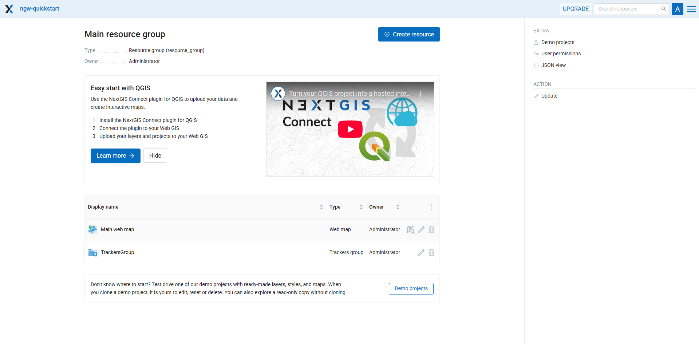

En NextGIS Web todo es un recurso: directorios, capas, Web Maps, conexiones a servicios y bases de datos. Los recursos se organizan como archivos en tu computadora, en un árbol.

Ya tienes un par de recursos:

* Main Web Map: un recurso predeterminado creado con el nuevo Web GIS;
* “TrackersGroup”: un recurso creado por la aplicación NextGIS Tracker cuando configuras la sincronización. También puedes gestionar trackers manualmente.

Haz clic en el ícono |button_open_web_map| para abrir el recurso “Main Web Map” en modo de visualización:

.. |button_open_web_map| image:: _static/button_open_web_map.png
   :width: 6mm
   :alt: mapa con una lupa

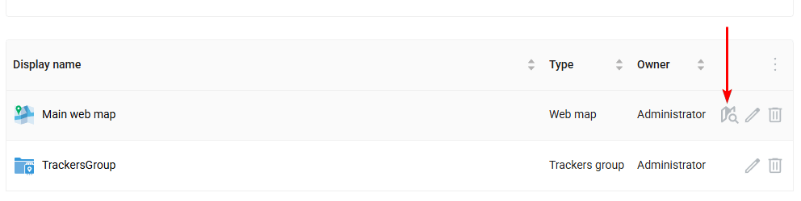

Este Web Map está vacío: no tiene capas, solo un mapa base predeterminado. Pero en el panel izquierdo hay un menú Trackers disponible; actívalo.

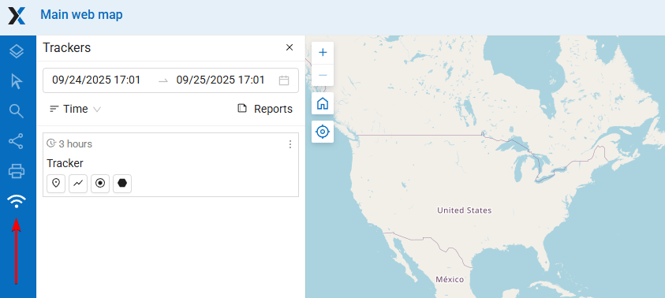

De forma predeterminada, puedes explorar los datos recolectados por tu app Tracker en cada Web Map creado en tu Web GIS. Esto se puede desactivar en Web Map settings.

El panel Trackers lista todos los dispositivos tracker conectados. Tienes solo un tracker conectado a Web GIS en este momento; haz clic en el botón |button_tracker_lastpoint| “Last known point”.

.. |button_tracker_lastpoint| image:: _static/button_tracker_lastpoint.png
   :width: 6mm
   :alt: forma puntiaguda con un punto

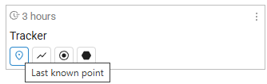

La última ubicación grabada se mostrará en el Web Map. Si el dispositivo con el tracker se mueve, lo verás en tiempo real.

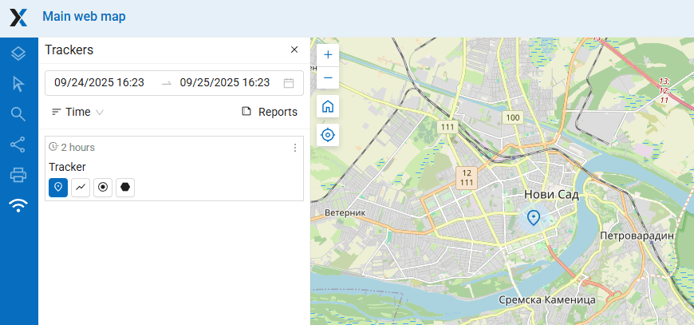

Al hacer clic en otros botones, podrás ver la línea del track y los puntos del track grabados dentro del rango de tiempo seleccionado.

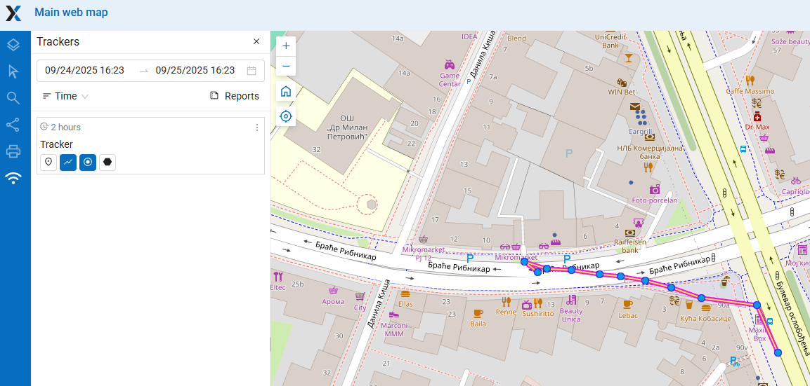

Pasa el cursor sobre los puntos del track para ver información detallada sobre la fecha, la hora, la velocidad, la dirección y otros parámetros.

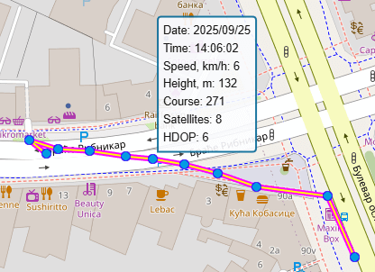

Después de recolectar algunos tracks, puedes analizarlos creando reports o exportar los tracks en formato GPX para compartir y crear una copia de seguridad.

Si tienes una suscripción Premium, puedes tener varios dispositivos conectados a tu Web GIS como trackers.

.. _report:

Crear reports
-------------

En el panel Trackers, haz clic en el ícono “Reports”:

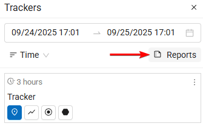

Aquí puedes crear diferentes tipos de reports.

En el menú desplegable "Report type", selecciona **Average speed**. Luego establece el rango de tiempo que cubra tu paseo de hoy. En el campo "Group by", selecciona agrupación por horas.

Marca el único tracker disponible y luego haz clic en el botón **Create report**.

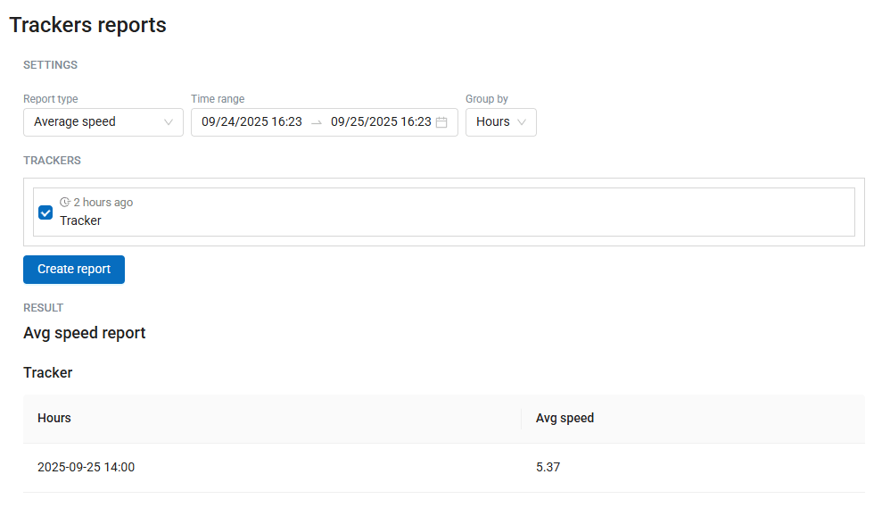

Obtendrás un cálculo rápido de la velocidad promedio.

.. _export:

Exportar archivo GPX
--------------------

Para exportar tu track como archivo, ve a la página Reports (ver :numref:`trackers_reports_pic`).

Luego, en el campo "Report type", selecciona **GPX file**.

Después de hacer clic en el botón **Create report**, obtienes el enlace “Download GPX file”. Este archivo GPX se puede usar en QGIS u otras aplicaciones.

.. _manage:

Gestionar trackers
------------------

Cuando habilitas la sincronización con Web GIS en la app NextGIS Tracker, esta configura todo del lado de Web GIS automáticamente, como se muestra en este tutorial.

Pero también puedes crear y gestionar trackers manualmente, creando un `recurso Trackers group y recursos Tracker <https://docs.nextgis.com/docs_ngcom/source/tracking.html#tracking-create>`_ dentro de él. Esto permite tener cientos de trackers conectados a Web GIS en un entorno de producción.

.. seealso::

   Otras apps móviles de NextGIS también admiten tracking y sincronización con Web GIS. Más detalles:

   * `NextGIS Mobile <https://docs.nextgis.com/docs_ngmobile/source/index.html>`_
   * `NextGIS Collector <https://docs.nextgis.com/docs_collector/source/index.html>`_