.. _tutorial-1:

Tutorial: Almacenamiento, gestión y publicación de tus datos espaciales
=======================================================================

.. admonition:: **Disponibilidad**

   **Cloud SaaS** (todas las ediciones), **On premise** (todas las ediciones), **Open Source**

NextGIS Web es un servidor GIS que funciona como centro de datos, te permitirá almacenar, administrar y publicar información espacial de manera flexible y eficiente. En este tutorial paso a paso, aprenderás a convertir tus archivos GIS en mapas web interactivos, así como en servicios OGC, teselas, y también a crear y gestionar datos directamente desde el servidor. ¡Regístrate para obtener una cuenta gratuita en la nube y pruébalo ahora mismo!

Descarga los `datos <https://nextgis.com/tutorials/store_manage_publish_geospatial_data.zip>`_ 
del tutorial (fuente: Sistema de Información Espacial de `Wroclaw <https://geoportal.wroclaw.pl/>`_) 

Basico

1. `Crear cuenta y SIG Web <tutorial_webgis.rst#paso-16-crear-una-cuenta-gratuita-y-sig-web>`_
2. `Crear grupo de recursos <tutorial_webgis.rst#paso-26-accede-a-tu-sig-web-y-crea-un-grupo-de-recursos>`_
3. `Cargar capa vectorial <tutorial_webgis.rst#paso-36-cargar-y-publicar-una-capa-vectorial>`_
4. `Cargar estilo <tutorial_webgis.rst#paso-46>`_
5. `Cargar capa ráster <tutorial_webgis.rst#paso-56>`_
6. `Publicar Mapa Web <tutorial_webgis.rst#paso-66>`_

Advanzado

7. `Agregar capa WMS externa al Mapa Web <tutorial_webgis.rst#Agregar-capa-WMS-externa-al-Mapa-Web>`_
8. `Agregar Mapa Base al Mapa Web <tutorial_webgis.rst#Agregar-Mapa-Base-al-Mapa-Web>`_
9. `Crear capa vectorial dentro del SIG Web <tutorial_webgis.rst#Crear-capa-vectorial-dentro-del-SIG-Web>`_
10. `Editar capa vectorial en el Mapa Web y adjuntar archivos <tutorial_webgis.rst#Editar-capa-vectorial-en-el-Mapa-Web-y-adjuntar-archivos>`_
11. `Publicar servicio OGC API - Features <tutorial_webgis.rst#Publicar-servicio-OGC-API---Features>`_
12. `Qué sigue? <https://docs.nextgis.com/docs_howto/source/tutorial_webgis.html#what-next>`_

.. _account:

Paso 1/6: Crear una cuenta gratuita y SIG Web
---------------------------------------------

Ve a `my.nextgis.com <https://my.nextgis.com/>`_, haz clic en el botón **Crear una cuenta** y regístrate con tu dirección de correo electrónico.

Una vez completado el registro, se mostrará la página de tu cuenta. Selecciona el menú **SIG Web** en el panel izquierdo, elige un nombre (en este ejemplo se usa *ngw-inicio.nextgis.com*) y selecciona la ubicación del centro de datos más cercana (en este ejemplo, *Falkenstein*). Luego, haz clic en **Crear un SIG Web**.

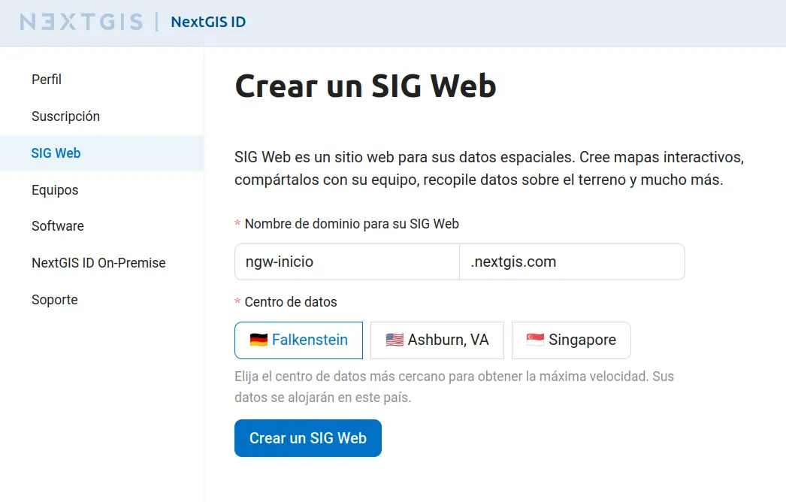

Cuando finalice el proceso de creación, el contenido de la página cambiará, y podrás ver un enlace directo a tu nuevo SIG Web.

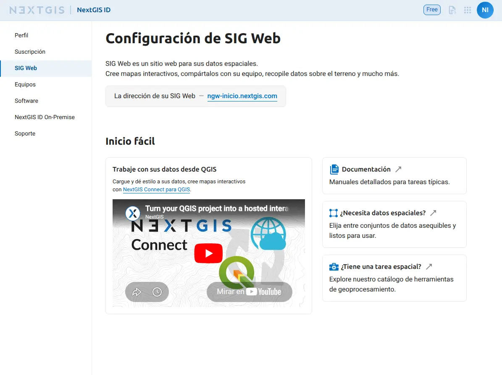

.. _webgis:

Paso 2/6: Accede a tu SIG Web y crea un grupo de recursos
---------------------------------------------------------

Haz clic en el enlace (para este ejemplo *ngw-inicio.nextgis.com*) o escríbelo directamente en la barra de direcciones de tu navegador.

Aparecerá la interfaz principal de tu SIG Web.

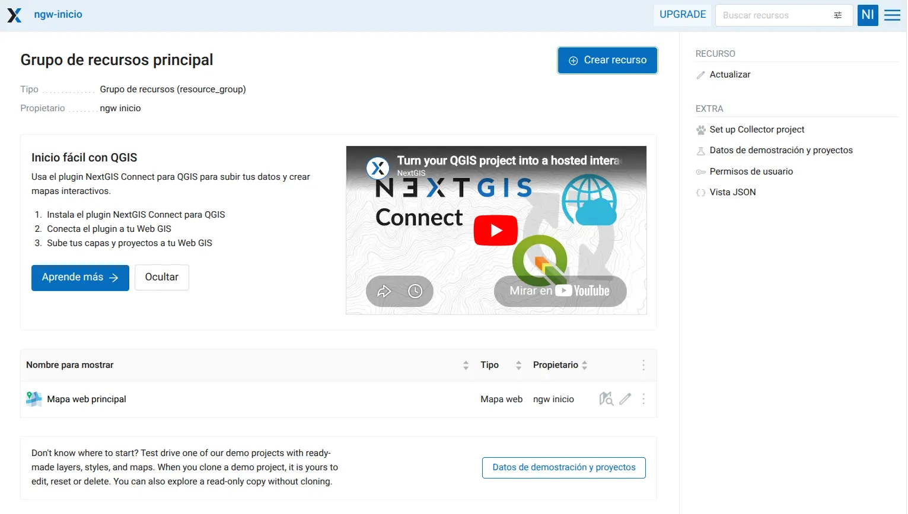

Es importante destacar que, en NextGIS Web, todo es un recurso: capas, mapas web, carpetas (grupos), conexiones a servicios y bases de datos. Estos recursos se organizan en forma de árbol, al igual que los archivos en tu ordenador.

Vamos a crear nuestro primer recurso: una carpeta o grupo de recursos llamado *Wroclaw*. Para ello, haz clic en el botón azul **Crear recurso**, situado en la parte superior de la página.

.. tip:: Si no visualizas el botón **Crear recurso**, primero debes iniciar sesión. Haz clic en el botón **Conectarse** (ubicado en la esquina superior derecha), a continuación, selecciona **Iniciar sesión con NextGIS ID**.

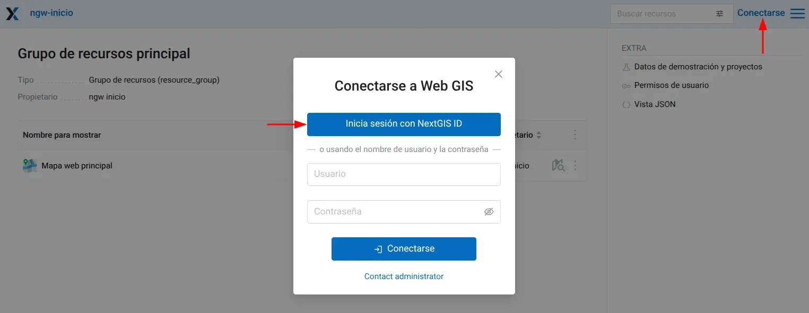

Cuando haces clic en **Crear recurso**, aparece una ventana que muestra todas las opciones de recursos disponibles que puedes crear en el contexto actual. Selecciona **Grupo de recursos**.

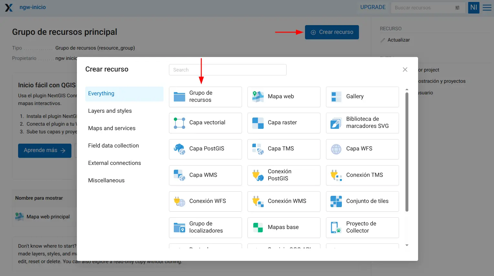

La ventana de creación de recursos consta de varias pestañas, en este caso solo necesitamos establecer el nombre *Wroclaw* en la pestaña **Recurso**.

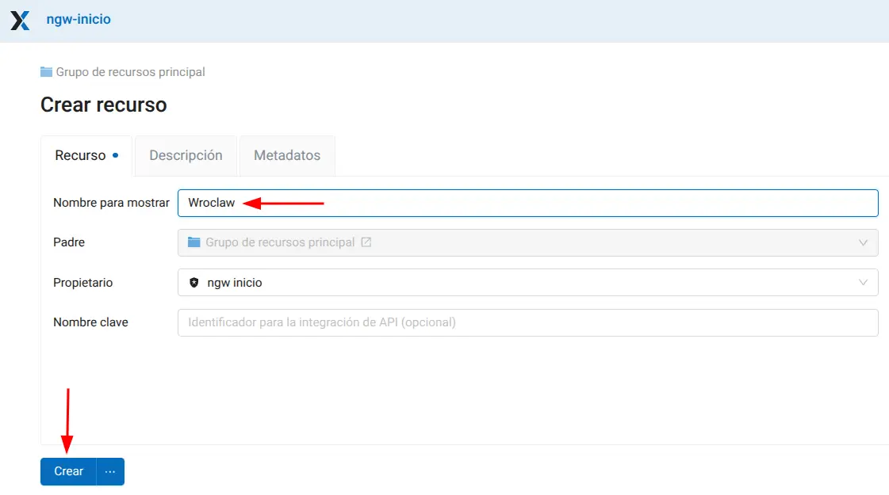

Clic en **Crear** y te redirigirá a la página del nuevo recurso.

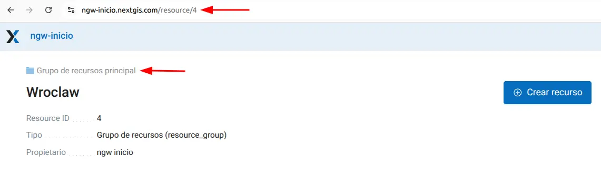

La URL en tu navegador es la ruta al recurso, y el número al final de la URL corresponde al ID del recurso.

*Wroclaw* es un elemento hijo dentro de la carpeta *Grupo de recursos principal* donde lo creamos. El recurso padre se muestra arriba del nombre del recurso.

Ahora puedes cargar datos en esta carpeta.

.. _vector:

Paso 3/6: Cargar y publicar una capa vectorial 
----------------------------------------------

Descarga los `datos <https://nextgis.com/tutorials/store_manage_publish_geospatial_data.zip>`_ del tutorial y descomprime el archivo en tu ordenador.

En tu SIG Web, dentro de la carpeta *Wroclaw*, haz clic en **Crear recurso** y selecciona el tipo de recurso **Capa vectorial**.

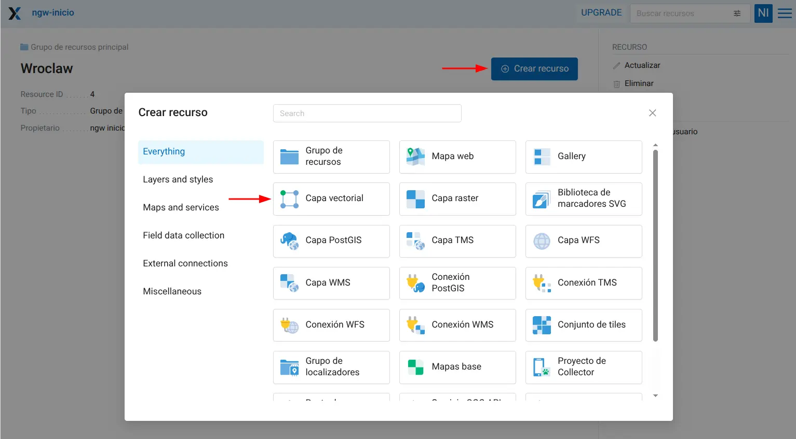

Verás la interfaz para la creación de recursos con varias pestañas. 

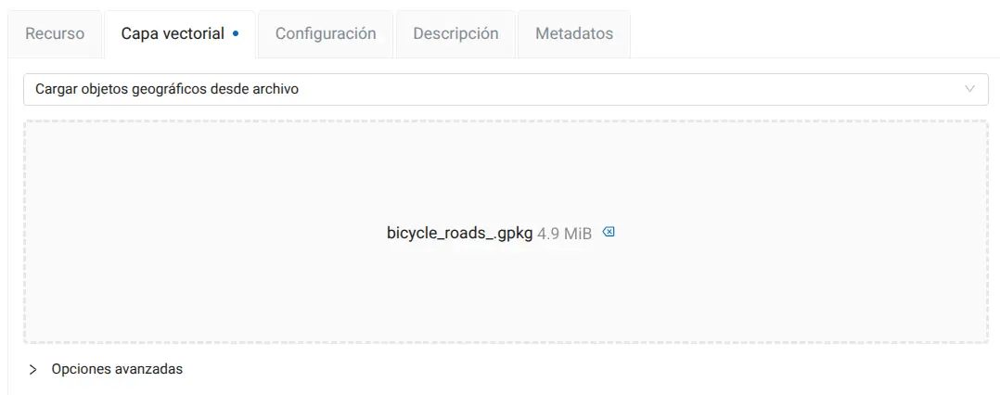

En la pestaña predeterminada llamada **Capa vectorial**, agrega el archivo llamado ``bicycle_roads.gpkg`` del conjunto de datos del tutorial. Puedes hacerlo mediante *arrastrar y soltar* el archivo, o bien un clic en **Seleccione un set de datos** y luego seleccionar el archivo.

Una vez finalizada la carga, se muestra el tamaño del archivo.

Ahora ve a la pestaña **Recurso** e ingresa el nombre para visualizar la nueva capa, por ejemplo *Bicisendas*. Luego haz clic en el botón **Crear**.

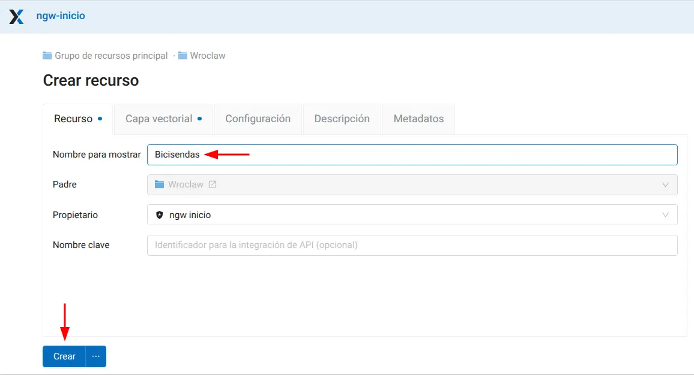

Creada la capa vectorial serás redirigido a su URL. Al igual que antes, el número al final de esta URL representa el ID de tu recurso capa.

Esta página contiene la información de la capa:

* Su ubicación en el árbol de recursos (*Grupo de recursos principal / Wroclaw*);
* Metadatos básicos (SRC, tipo de geometría, recuento de objetos geográficos, etc.);
* Listado de **Campos**, también conocido como estructura de atributos.

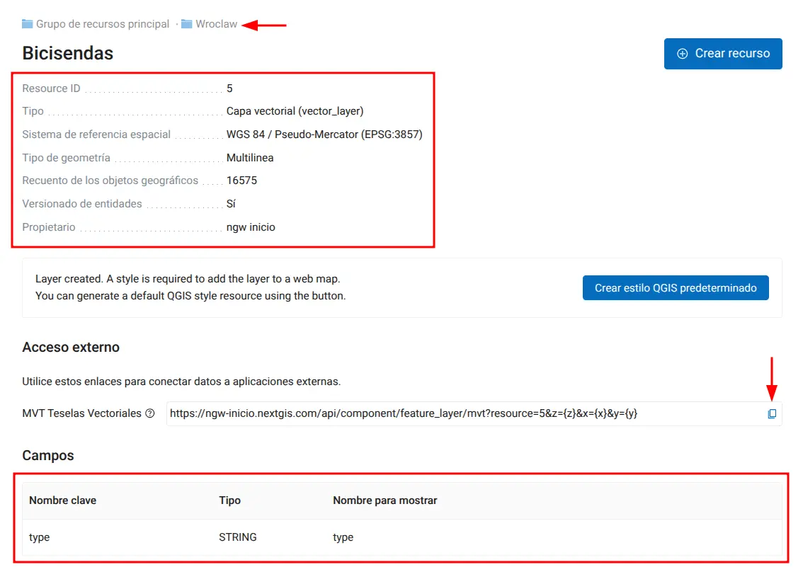

En la sección de **Acceso externo** encontrarás una URL generada automáticamente que permite acceder a la capa como MVT Teselas Vectoriales. Puedes, ahora mismo, conectar estos datos a una aplicación web o agregarlos a QGIS mediante este enlace. Más información sobre `MVT Teselas Vectoriales <https://docs.nextgis.com/docs_ngweb/source/services.html#mvt-vector-tiles>`_.

Para ver los datos, abre la tabla de características haciendo clic en |button_open_feature_table| **Tabla** en el menú de la derecha

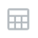

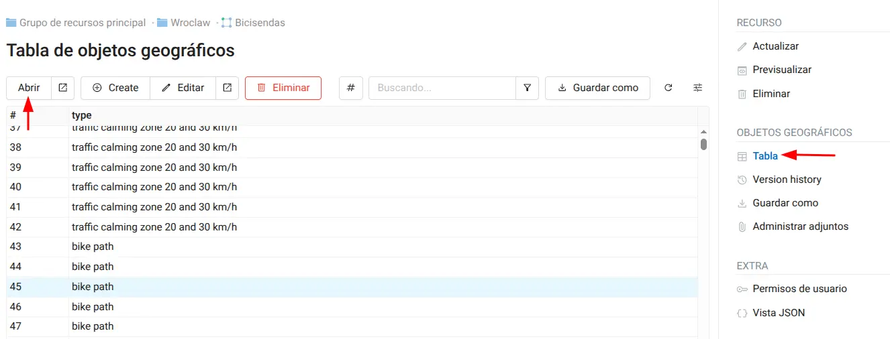

Selecciona cualquier característica y haz clic en **Abrir** para verla.

Se abrirá una ventana, en la que verás todas las propiedades del elemento seleccionado, incluidos los atributos, geometría y una representación cartográfica superpuesta al mapa base predeterminado.

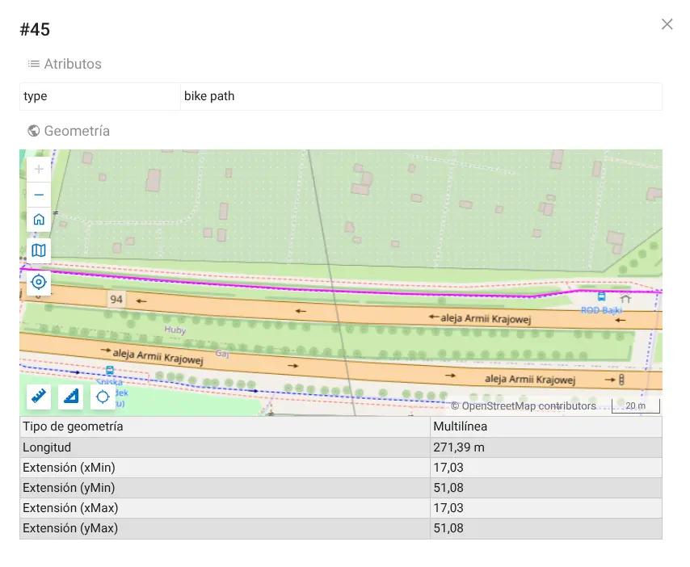

La tabla de entidades permite inspeccionar, editar y gestionar las entidades de la capa vectorial como registros de base de datos independientes, sin necesidad de usar mapas u otras aplicaciones. (`Más información <https://docs.nextgis.com/docs_ngweb/source/feature_table.html#ngw-feature-table-blank>`_ )

.. _style:

Paso 4/6: Cargar estilo
-----------------------

Si deseas generar **teselas TMS** o **añadir una capa a un Mapa Web**, es necesario definir su apariencia, es decir, su *estilo*. Puedes hacer clic en **Crear un estilo QGIS por defecto**. Para esta capa disponemos de un archivo especial que determina los colores y la estructura de las líneas en función de los valores de los atributos.

En la página de la capa, haz clic en el botón **Crear recurso**. Verás un conjunto diferente de recursos disponibles, ya que una capa vectorial solo puede ser el elemento padre de estilos y formularios. Empleamos los estilos QGIS como la vía principal para definir la apariencia de los datos. Selecciona **Estilo vectorial de QGIS**.

.. figure:: _static/tutorial_select_qstyle_en.png

Carga el archivo llamado ``bicycle_roads.qml`` del conjunto de datos del tutorial. Luego, haz clic en el botón **Crear**.

.. figure:: _static/tutorial_create_qstyle_en.png

Una vez creado el estilo vectorial, serás redirigido a la página del estilo. Pulsa **Vista previa** en el menú lateral derecho para comprobar su aspecto final.

En la sección **Acceso externo** encontrarás una URL autogenerada que te permitirá acceder a estos datos con el estilo aplicado como un *Servicio de Mapas Teselados (TMS)*, el cual podrás importar, por ejemplo, directamente en QGIS. Para más información, consulta la sección dedicada a `TMS <https://docs.nextgis.com/docs_ngweb/source/services.html#tms-service>`_.

A continuación, puedes cargar otro tipo de capa o saltar directamente a la `Publicar Mapa Web <tutorial_webgis.rst#paso-66-publicar-mapa-web>`_.

.. _raster:

Paso 5/6: Cargar capa ráster
----------------------------

Vuelve al grupo de recursos *Wroclaw* haciendo clic en su nombre en la ruta de navegación.

.. figure:: _static/tutorial_return_folder_en.png
   :name: 
   :align: center
   :width: 20cm

Haz clic en el botón **Crear recurso** y selecciona **Capa ráster**.

.. figure:: _static/tutorial_select_raster_layer_en.png
   :name: 
   :align: center
   :width: 20cm

En la pestaña **Capa ráster**, arrastra y suelta el archivo denominado ``plan.tif`` del conjunto de datos del tutorial, o haz clic en **Seleccionar el conjunto de datos** y selecciona el archivo. Luego, haz clic en el botón **Crear**.

.. figure:: _static/tutorial_raster_upload_en.png
   :name: 
   :align: center
   :width: 20cm

Se crea la capa ráster y se te redirige a su página. Aquí puedes ver:
* Su ubicación en el árbol de recursos (*Grupo de recursos principal / Wroclaw*).
* Metadatos básicos (bandas, dimensiones, etc.).

.. figure:: _static/tutorial_raster_result_en.png
   :name: 
   :align: center
   :width: 20cm

En la sección **Acceso externo** encontrarás una URL de acceso **GeoTIFF optimizado para la nube** generada automáticamente para estos datos. Con este enlace puedes conectar estos datos a recursos externos al instante.

Puedes aplicar estilos de QGIS a los recursos ráster creando subrecursos. Sin embargo, para archivos ráster RGB(A), basta con hacer clic en **Crear estilo QGIS predeterminado**. Hagámoslo. Se crea el estilo ráster predeterminado y se te redirige a su página.

.. figure:: _static/tutorial_def_raster_style_result_en.png
   :name: 
   :align: center
   :width: 20cm

La URL de acceso a **Teselas ráster (TMS)** para estos datos también se genera de forma automática. Puedes utilizar este enlace para conectar estos datos a recursos externos como teselas ráster con el estilo ya aplicado.

También puedes hacer clic en **Vista previa** en el menú derecho y explorar el ráster que acabas de cargar.

.. figure:: _static/tutorial_raster_preview_en.png
   :name: 
   :align: center
   :width: 20cm

Ahora vamos a crear un mapa web con los datos que acabamos de cargar.

.. _webmap:

Paso 6/6: Publicar Mapa Web
---------------------------

Ahora que ya tenemos un par de capas con estilos aplicados, estamos listos para publicar nuestro primer mapa web. Vuelve al grupo de recursos *Wroclaw* y crea un nuevo recurso: **Mapa Web**.

.. figure:: _static/tutorial_select_webmap_en.png
   :name: 
   :align: center
   :width: 20cm

Hay muchos parámetros que se pueden configurar para un mapa web. En la pestaña **Recurso**, introduce el nombre del mapa, por ejemplo, *Wroclaw*.

.. figure:: _static/tutorial_webmap_name_en.png
   :name: 
   :align: center
   :width: 20cm

En la pestaña **Capas** se define el contenido de este mapa web. Haz clic en el botón |button_plus_layer| **Capa**. Lo que se añade al mapa es la representación visual de los datos, por lo que **debes seleccionar estilos, no capas**. Es por eso que las casillas de verificación junto a los nombres de las capas no están activas. Puedes hacer clic en una capa y seleccionar su estilo secundario, o simplemente hacer clic en el botón **Seleccionar el primer recurso hijo elegible** |button_pick_first| que aparece a la derecha de la capa para seleccionarla. Selecciona tanto la capa *Bicisendas* como la capa *plan*.

.. |button_pick_first| image:: _static/button_pick_first.png
   :width: 6mm

.. |button_plus_layer| image:: _static/button_plus_layer.png
   :width: 6mm

.. figure:: _static/tutorial_webmap_add_layers_en.png
   :name: 
   :align: center
   :width: 20cm

Después de eso, puedes hacer clic en la capa para editar sus propiedades.

.. figure:: _static/tutorial_webmap_layer_settings_en.png
   :name: 
   :align: center
   :width: 20cm

Cambia a la pestaña **Configuración**. Busca la fila *Extensión inicial* y haz clic en el botón **Desde capa**. Luego selecciona la capa *Bicisendas* y haz clic en el botón **Tomar seleccionado**. Ahora el mapa se abrirá mostrando el área de esta capa.

.. figure:: _static/tutorial_webmap_extent_en.png
   :name: 
   :align: center
   :width: 20cm

Haz clic en el botón **Crear** para finalizar la creación del mapa web.

Los recursos de tipo mapa web tienen un modo especial de visualización. Se puede acceder a él desde el panel derecho de la interfaz del recurso.

.. figure:: _static/tutorial_webmap_display_en.png
   :name: 
   :align: center
   :width: 16cm

O, si vuelves al grupo de recursos *Wroclaw*, haz clic en el ícono de mapa |button_open_web_map| que se encuentra a la derecha del nombre del recurso Mapa Web.

Al hacer clic en |button_open_web_map| **Visualización**, se abrirá un mapa web interactivo. Cada mapa tiene su propia URL de visualización y cuenta con numerosas herramientas para explorar y administrar los datos.

.. figure:: _static/tutorial_webmap_displayed_en.png
   :name: 
   :align: center
   :width: 20cm

Las pestañas de la izquierda permiten administrar capas, identificar, buscar y editar elementos geográficos, así como compartir o imprimir el mapa. Consulta la `documentación <https://docs.nextgis.com/docs_ngweb/source/webmaps_client.html>`_ para obtener más información sobre las herramientas y paneles del mapa web.  

Puedes crear tantos mapas web como necesites, combinando las capas disponibles y sus estilos.

Exploremos qué más puedes hacer con NextGIS Web:

* `Agregar capa WMS externa al Mapa Web <tutorial_webgis.rst#Agregar-capa-WMS-externa-al-Mapa-Web>`_
* `Agregar Mapa Base al Mapa Web <tutorial_webgis.rst#Agregar-Mapa-Base-al-Mapa-Web>`_.
* `Crear capa vectorial dentro del SIG Web <tutorial_webgis.rst#Crear-capa-vectorial-dentro-del-SIG-Web>`_.
* `Editar capa vectorial en el Mapa Web y adjuntar archivos <tutorial_webgis.rst#Editar-capa-vectorial-en-el-Mapa-Web-y-adjuntar-archivos>`_.
* `Publicar servicio OGC API - Features <tutorial_webgis.rst#Publicar-servicio-OGC-API---Features>`_.

.. _wms:

Agregar capa WMS externa al Mapa Web
------------------------------------

Puedes conectar datos externos `WMS <https://docs.nextgis.com/glossary.html#term-WMS>`_, `WFS <https://docs.nextgis.com/glossary.html#term-WFS>`_, `TMS <https://docs.nextgis.com/glossary.html#term-TMS>`_ y `PostGIS <https://docs.nextgis.com/glossary.html#term-PostGIS>`_ a NextGIS Web. Vamos a explorarlo con el ejemplo de la ortofoto de *Wroclaw* que se ofrece como un servicio WMS público.

Vuelve al grupo de recursos de *Wroclaw* y crea un nuevo recurso: **Conexión WMS**.

.. figure:: _static/tutorial_select_wms_con_en.png
   :name: 
   :align: center
   :width: 20cm

En la pestaña Recurso, establece el nombre: *Servicio de ortofoto de Wroclaw*

.. figure:: _static/tutorial_wms_con_name_en.png
   :name: 
   :align: center
   :width: 20cm

En la pestaña **Conexión WMS**, establece la URL: ``https://gis1.um.wroc.pl/arcgis/services/ogc/OGC_ortofoto_2024/MapServer/WMSServer``

.. figure:: _static/tutorial_wms_con_link_en.png
   :name: 
   :align: center
   :width: 20cm

Luego, haz clic en el botón **Crear**.

Vuelve al grupo de *Wroclaw* y crea otro recurso: **Capa WMS**.

.. figure:: _static/tutorial_select_wms_layer_en.png
   :name: 
   :align: center
   :width: 20cm

En la pestaña **Recurso**, establece el nombre: *Capa de ortofoto de Wroclaw*.

.. figure:: _static/tutorial_wms_layer_name_en.png
   :name: 
   :align: center
   :width: 20cm

En la pestaña **Capa WMS**, haz clic en el campo **Conexión WMS** y selecciona el recurso **Servicio de ortofoto de Wroclaw**, luego haz clic en **Seleccionar lo elegido**.

.. figure:: _static/tutorial_wms_layer_pick_con_en.png
   :name: 
   :align: center
   :width: 20cm

En la lista desplegable **Formato de imagen**, selecciona **image/png**, y en la lista desplegable de **Capas WMS**, selecciona **Ortofotomapa 2024 - GUGiK**

.. figure:: _static/tutorial_wms_layer_settings_en.png
   :name: 
   :align: center
   :width: 20cm

Luego, haz clic en el botón **Crear**. La conexión WMS y la capa fueron creadas.

En la sección **Acceso externo**, encontrarás una URL generada automáticamente que se puede usar para conectar los datos como teselas ráster. Ahora mismo puedes agregar estos datos a una aplicación web o a una aplicación de escritorio como QGIS. Tu Web GIS actúa como un *proxy* para el servicio WMS.

.. figure:: _static/tutorial_wms_layer_result_en.png
   :name: 
   :align: center
   :width: 20cm

Para **Agregar la capa WMS al Mapa Web**, vuelve al grupo de recursos de *Wroclaw* y haz clic en el ícono |button_edit| del lápiz de editar junto al Mapa Web.

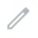

.. figure:: _static/tutorial_webmap_edit_select_en.png
   :name: 
   :align: center
   :width: 20cm

En la pestaña **Capas**, haz clic en el botón |button_plus_layer| **Capa**, selecciona *Capa de ortofoto de Wroclaw* y haz clic en el botón **Seleccionar lo elegido**. La capa WMS ahora se agrega al Mapa Web.

.. figure:: _static/tutorial_webmap_add_wms_en.png
   :name: 
   :align: center
   :width: 20cm

Guarda el mapa y ábrelo en modo de visualización. Verás que un ortofotomapa detallado de una fuente externa ahora sirve como base para los datos cargados anteriormente.

.. figure:: _static/tutorial_webmap_with_wms_en.png
   :name: 
   :align: center
   :width: 20cm

.. _basemap:

Agregar Mapa Base al Mapa Web
-----------------------------

Por defecto, los Mapas Web usan el mapa base estándar de *OpenStreetMap (OSM)*. También puedes conectar otros mapas base y usarlos con tus Mapas Web.

Vuelve al grupo de recursos de *Wroclaw* y crea un nuevo recurso: **Mapa base**.

.. figure:: _static/tutorial_select_basemap_en.png
   :name: 
   :align: center
   :width: 20cm

Aquí puedes usar nuestra colección colaborativa pública de servicios de mapas, qms.nextgis.com. Comienza a escribir el nombre del mapa base en el campo **Elegir de QMS** y selecciona lo que necesites de los resultados de la búsqueda.

.. figure:: _static/tutorial_qms_pick_poistron_en.png
   :name: 
   :align: center
   :width: 20cm

Todos los demás campos se completarán automáticamente, y también habrá una vista previa disponible para explorar el mapa base seleccionado.

Una forma alternativa de crear un mapa base es introducir manualmente la URL de una **Tesela XYZ**.

Usa el control deslizante en la esquina superior derecha para comparar este mapa base con el predeterminado de *OSM*.

.. figure:: _static/tutorial_basemap_preview_en.png
   :name: 
   :align: center
   :width: 20cm

En la pestaña **Recurso**, establece el nombre del mapa base.

.. figure:: _static/tutorial_basemap_name_en.png
   :name: 
   :align: center
   :width: 20cm

Haz clic en el botón **Crear**.

Para agregar el mapa base recién creado al Mapa Web, vuelve al grupo de recursos de *Wroclaw* y edita con |button_edit| el recurso **Mapa Web**.

.. figure:: _static/tutorial_webmap_enter_update_en.png
   :name: 
   :align: center
   :width: 20cm

En la pestaña **Mapas base**, haz clic en el botón |button_plus_layer| **Agregar** y selecciona el recurso **Mapa base** creado. Luego, haz clic en **Seleccionar lo elegido** y guarda el Mapa Web.

.. figure:: _static/tutorial_webmap_add_basemap_en.png
   :name: 
   :align: center
   :width: 20cm

Abre el Mapa Web en modo de visualización |button_open_web_map|. Ahora ya puedes usar el nuevo mapa base.

.. figure:: _static/tutorial_webmap_positron_en.png
   :name: 
   :align: center
   :width: 20cm

.. _empty_layer:

Crear capa vectorial dentro del SIG Web
---------------------------------------

No solo es posible cargar datos desde archivos, sino que también puedes crear conjuntos de datos directamente dentro del Web GIS.

Vuelve al grupo de recursos *Wroclaw* y crea un nuevo recurso **Capa vectorial**.

.. figure:: _static/tutorial_select_empty_layer_en.png
   :name: 
   :align: center
   :width: 20cm

A continuación, abre el menú desplegable de la pestaña **Capa vectorial** y selecciona **Crear capa vacía**.

.. figure:: _static/tutorial_create_empty_layer_en.png
   :name: 
   :align: center
   :width: 20cm

En la nueva interfaz, selecciona el tipo de geometría **Punto**.

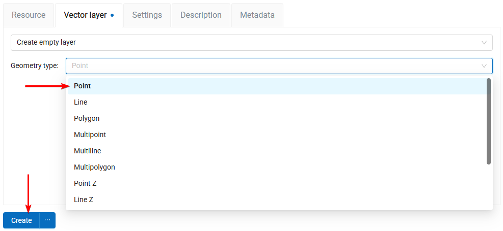

En la pestaña **Recurso**, asigna un nombre a la nueva capa, por ejemplo, *Estacionamientos de bicicletas*, y haz clic en el botón **Crear**.

.. figure:: _static/tutorial_empty_layer_name_en.png
   :name: 
   :align: center
   :width: 20cm

Una vez que la capa vectorial es creada, serás redirigido a su URL. Ahora podrás añadirle atributos, para ello haz clic en el botón |button_edit| **Actualizar** en el menú de la derecha.

.. figure:: _static/tutorial_empty_layer_result_en.png
   :name: 
   :align: center
   :width: 20cm

Aquí, en la pestaña **Campos**, haz clic en el botón |button_plus_layer| **Añadir**.

Configura las propiedades del nuevo campo en el panel lateral:

* Display name: ``Number of parking spaces``, 
* Keyname: ``parking_spaces``, 
* Type: INTEGER. 

.. figure:: _static/tutorial_add_field_en.png
   :name: 
   :align: center
   :width: 16cm

Luego, haz clic en el botón **Guardar**.

Ahora es momento de crear un *estilo* para la nueva capa. En la página del recurso de la capa vectorial, haz clic en **Crear recurso** y selecciona **Estilo vectorial QGIS**.

En la pestaña **Estilo QGIS**, abre el menú desplegable y selecciona **Estilo definido por el usuario**.

.. figure:: _static/tutorial_style_custom_select_en.png
   :name: 
   :align: center
   :width: 20cm

Aquí tienes disponible un constructor de estilos simple. Recomendamos usar QGIS para crear estilos, pero para tareas rápidas, este constructor integrado puede ser útil. Configura un círculo azul de tamaño 12 y un borde blanco de ancho 1. Luego, haz clic en el botón **Crear**.

.. figure:: _static/tutorial_style_custom_set_en.png
   :name: 
   :align: center
   :width: 20cm

Se ha creado una nueva capa vectorial dentro del Web GIS.

Ahora puedes añadirla a los Mapas Web y publicarla a través de `Servicios OGC <https://docs.nextgis.com/docs_howto/source/tutorial_webgis.html#publish-ogc-api-features-service>`_

Aunque primero, añadiremos algunas entidades a la capa, recién creada, usando la interfaz web.

.. _edit:

Editar capa vectorial en el Mapa Web y adjuntar archivos
--------------------------------------------------------

Vuelve al grupo de recursos *Wroclaw* y entra en el modo |button_edit| **Actualizar** del Mapa Web.

.. figure:: _static/tutorial_webmap_edit_select_en.png
   :name: 
   :align: center
   :width: 20cm

Primero, ve a la pestaña **Capas**, haz clic en el botón |button_plus_layer| **Añadir capa** y agrega la capa *Estacionamientos de bicicletas* haciendo clic en |button_pick_first| **Seleccionar el primer recurso hijo elegible** en el lado derecho de la capa. Luego, haz clic en **Seleccionar el seleccionado** y arrastra la capa *Estacionamientos de bicicletas* a la parte superior de la lista de capas.

.. figure:: _static/tutorial_webmap_add_empty_en.png
   :name: 
   :align: center
   :width: 20cm

A continuación, ve a la pestaña **Configuración**, busca el menú desplegable **Edición de capas** y selecciona **Habilitar**. Guarda los cambios.

.. figure:: _static/tutorial_webmap_enable_editing_en.png
   :name: 
   :align: center
   :width: 20cm

Acabas de añadir la nueva capa vectorial al mapa y has activado la edición de capas. Ahora ve al modo |button_open_web_map| **Visualizar** del mapa.

.. figure:: _static/tutorial_webmap_display_en.png
   :name: 
   :align: center
   :width: 16cm

Haz zoom a un lugar en el mapa donde te gustaría colocar un nuevo estacionamiento de bicicletas. Luego, abre el menú contextual de la capa haciendo clic en los tres puntos a la derecha de su nombre y selecciona |button_edit| **Editar**.

.. figure:: _static/tutorial_layer_start_edit_en.png
   :name: 
   :align: center
   :width: 16cm

Han aparecido nuevas herramientas en el mapa. 

Selecciona la herramienta |button_maptool_plus| y haz clic en el lugar deseado.

.. |button_maptool_plus| image:: _static/button_maptool_plus.png
   :width: 6mm
   :alt: +

.. figure:: _static/tutorial_add_point_en.png
   :name: 
   :align: center
   :width: 20cm

Aparecerá una ventana emergente donde puedes establecer los valores de los atributos, por ejemplo, **15** para el número de plazas de estacionamiento.

.. figure:: _static/tutorial_add_point_attr_en.png
   :name: 
   :align: center
   :width: 20cm

Hay dos pestañas adicionales disponibles. En la pestaña **Descripción** puedes ingresar cualquier texto enriquecido con imágenes para describir la entidad. En la pestaña **Archivos adjuntos**, puedes adjuntar un número ilimitado de fotos o cualquier tipo de archivo a la entidad. Cambia a la pestaña **Archivos adjuntos**, haz clic en el botón |button_upload| **Subir** y selecciona los archivos ``Bicycle_parking.jpg`` y ``WRM_Regulations.pdf`` del conjunto de datos del tutorial.

.. |button_upload| image:: _static/button_upload.png
   :width: 6mm

.. figure:: _static/tutorial_add_attachments_en.png
   :name: 
   :align: center
   :width: 20cm

Haz clic en el botón **Aceptar** para guardar la entidad. 

Luego, vuelve al menú contextual de la capa **Estacionamientos de bicicletas** y haz clic en **Dejar de editar**.

.. figure:: _static/tutorial_stop_edit_en.png
   :name: 
   :align: center
   :width: 14cm

Confirma las ediciones haciendo clic en el botón **Guardar** en el cuadro de diálogo emergente.

.. figure:: _static/tutorial_edit_confirm_en.png
   :name: 
   :align: center
   :width: 12cm

Se ha creado una nueva entidad.

Haz clic en el símbolo del punto en el mapa. Aparecerá un panel de identificación donde podrás explorar los atributos y archivos adjuntos de la entidad.

.. figure:: _static/tutorial_feature_identify_en.png
   :name: 
   :align: center
   :width: 20cm

Haz clic en las fotos y panoramas adjuntos para verlos.

Ahora que tenemos datos en esta capa, publiquémosla a través de OGC API Features.

.. _ogc_api:

Publicar servicio OGC API - Features
------------------------------------

Publicaremos esta capa con el protocolo OGC API — Features, para que pueda ser editada en software externo. Vuelve al grupo de recursos **Wroclaw** y crea un nuevo recurso, **Servicio OGC API Features**.

.. figure:: _static/tutorial_select_ogcapif_en.png
   :name: 
   :align: center
   :width: 20cm

La creación del servicio es un proceso sencillo. Todo lo que necesitas es seleccionar una capa.

En la pestaña del **Servicio OGC API Features**, haz clic en el botón |button_plus_layer| **Agregar capa** y selecciona la capa **Estacionamientos de bicicletas**, luego haz clic en el botón **Seleccionar los elegidos**.

.. figure:: _static/tutorial_ogcapif_select_layer_en.png
   :name: 
   :align: center
   :width: 20cm

Por defecto, el recurso se llamará simplemente *OGC API Features service*, para establecer un nombre personalizado, ve a la pestaña **Recurso** e ingresa **Estacionamientos de bicicletas (servicio de entidades)**. Luego haz clic en el botón **Crear**.

.. note:: El nombre *Estacionamientos de bicicletas* ya está siendo usado para el recurso de capa vectorial, por lo que debes agregar *servicio de entidades* al final.

.. figure:: _static/tutorial_ogcapif_name_en.png
   :name: 
   :align: center
   :width: 20cm

Al crear el servicio serás redirigido a su URL. En la sección **Acceso externo** puedes ver el *enlace* del servicio publicado. Copia la URL para usarla en aplicaciones externas.

.. figure:: _static/tutorial_ogcapif_result_en.png
   :name: 
   :align: center
   :width: 20cm

.. _next:

Qué sigue?
----------

Felicitaciones! completaste el tutorial y aprendiste los conceptos básicos de la gestión de datos geoespaciales en NextGIS Web.

Todavía hay muchas cosas por explorar. Puedes aprender a:

* administrar usuarios y permisos, para configurar combinaciones de acceso únicas para cada capa, servicio y mapa;
* administrar sistemas de referencia de coordenadas;
* administrar datos directamente desde QGIS, incluyendo la publicación de proyectos, la gestión de estilos y la edición colaborativa;
* y mucho más.

Prueba otros tutoriales o profundiza en la documentación para aprender más.
